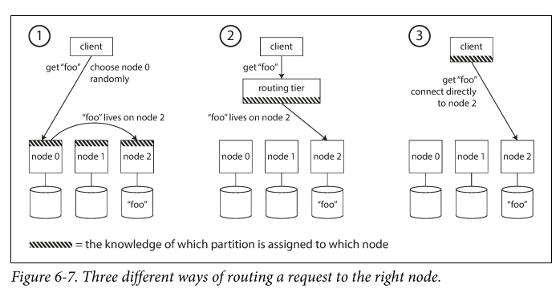

# Designing Data-Intensive Applications 
Kleppmann
2017

## Chapter 01: Reliable Scalable and Maintainable Apps
Apps today are data intensive instead of Compute intensive
- they need to store data so they or another app can find it (DB) 
- Remember the result fo expensive operation (cache) 
- ALlow users to search data by keyword of filter it in various ways (search indexes) 
- send messages to another process to be handled async (stream)
- periodically crunch a large amount of accumulated data (batch)

during design, tricky questions
- how do you ensure data remains correct and complete, even during errors?
- how do you provide good performance, even when degraded
- how do you scale
- what does good API look like

Reliability
- software expectations
    - app performs the functions
    - it can tolerate the user making mistakes or used in unexpected ways
    - performs good enough, despite load
    - prevents unauthz and abuse
- fault != failure
    - fault is 1 component deviating from its spec
    - failure is system as a who stops
    - increase rate of faults to test a fault tolerant system
    - Hardware faults
        - Disk crash, RAM, power outage
        - Mean time to failure (MTTR)
        - used to solve bu adding redundancy, but with cloud scale, it is expensive
    - software errors
        - bugs cause crash
        - runaway processes 
        - service becomes unresponsive
        - cascading failures 
    - Human errors
- How to design for reliability
    - minimized opportunities for errors: well designed abstractions, APIs, interfaces without over designing forcing human to work around
    - decouple
    - add sandboxes for experiments
    - Test thoroughly
    - allow for easy recovery
    - detailed and clear monitoring
    - training

Scalability
- reliable today doesn't mean reliable tomorrow
- ability to cope with increased load
- Describing Load (load parameters)
    - depends on the architecture of ths system
        - requests per sec, ration of reads to writes, num active users, etc.
        - it is what matters, or the bottleneck
- describing performance
    - with load described, you investigate what happens when load increases
        - when a load param increases and resources are unchanged, how is system affected?
        - when load param increases, how do resources need to increase to prevent performance drop
    - throughput: number of items per sec
    - response time: time between request and response
        - common to look for averages, then median
- Approach to cope with load
    - horizontal scaling - add machines
    - vertical scaling - add resources to the same machine
    - often a few medium/large machines is better for cont and load than many small machines
    - auto or elastic scaling
    - Architecture depends on the application
        - 100k requests/s each 1kb is different than 3 requests/s of 2GB even though throughput is the same.

Maintainability
- Design software for maintainability
    - Operability: easy for ops to keep system running
        - provide good visibility into runtime behavior
        - prod good support for automation and integration
        - avoid dependency on individual machines
        - provide good docs
        - provide good defaults
        - self healing
        - predictable
    - simplicity: easy for new engineers to understand
        - add good abstractions
    - Evolvability: easy to change
        - refactor as needed

## Chapter 02: Data Models and Query Languages
data models are most important part of software dev
Relational vs Document models
- NoSQL and document arrived to b/c
    - need more scalability
    - open sources
    - specialized query operations
    - too much restriction in relational
- Object oriented apps require transition layers between objs, adding code. This is called impedance mismatch
    - adding JSON models reduced the mismatch
    - try and avoid duplicated relationships
        - many to 1; many to many 
        - removing the duplications is called normalization
        - normalization doesn't fit well in Document DBs
- Document is hierarchial model wrt storing nested records (1-to-many)
- Today the data in the app helps determine which model is used.
    - document has poor joins, but good flexibility
    - Relational has great structure and joins, but schema updates are hard
    - Document typically has data locality for performance
    - modern relational support JSON and XML now
    - some documents support joins
Query languages
- declarative
    - typically more concise and readable
    - lend to better parallel
- Imperative
    - 
- MapReduce Querying
    - somewhere between declarative and imperative

Graph-like Data models
- good for many-to-many relationships
- graphs have 2 kinds of objects
    - vertices (also known as nodes or entities)
    - edges (also known as relationships or arcs)
- examples of data modeled as a graph
    - social graphs- vertices are people, edges indicate which people know each other
    - web graph - vertices are webpages, edges indicate links to other pages
    - road or rail networks - vertices are junctions, edges are road/rails between them
- not limited to homogeneous data
- many ways to structure data in a graph
    - property graphs
        - Graph Queries in SQL: can be done, but hard
        - Triple-Stores - same as property graphs, but different words
        - SPARQL is a query language for Triple stores

## Chapter 03: Storage and Retrieval
Data structures that power your Database
- Key value data (dictionaries)
- Hash tables
- Sorted String Tables (SSTables)
- Log Structure Merge Trees (LSM Trees)
    - have lower write amplification
    - can be compressed better
    - compactions will impact performance
    - becoming increasingly popular
- B Trees
    - LSM faster for writes; B-trees faster for reads
    - B trees must write everything twice, once to write ahead and once to the tree
- Others
    - primary index
    - secondary index
    - multi column index
    - full-text search and fuzzy indexes

Transaction processing or Analytics

- Data warehousing

- Stars and Snowflakes: schemas for analytics

Column-Oriented Storage
- tables may be 100s of columns wide, but often, we only need 4-5 of them.
- idea here is don't store all the values from from 1 row together, but store all the values from each column together. If each column is a file, then you only need to read the files for the columns that you need.
- Can be compressed too
- Sort order doesn't matter; usually stored in the order they were written
    - then can be ordered: C-store
- Writing uses LSM-trees
- Data cubes and Materialized Views

## Chapter 04: Encoding and Evolution
Formats for encoding data
- in mem, data in objects, struct, lists, arrays, hash tables, trees, etc.
- when written to a file, encoded i.e. JSON]
- translation is needed
- Each language has specific in memory formats, but prefer standardized encodings
    - JSON, XML, CSV: all textual formats
        - subtle problems
            - JSON cannot distinguish between integer and float
            - bad for binary strings
            - JSON rarely uses schema
            - No schema for CSV
- when data is in terabytes, it really matters, binary encoding like messagepack can help: 

- Thrift and Protocol Buffers
    - binary encoding libs based on the same principle
    - required a schema for data that is encoded
    - schema evolves over time via field tag
    - add new fields to the schema
- Avro
    - another binary encoding
    - uses a schema, has 2 dif languages: 1 for human editing (IDL); 1 for machine (based on JSON)
    - no tag numbers
    - schema evolves with writes and reader schemas - they do not have to be the same. Avro resolve
    - null is not valid type; 
    - This enables dynamic generated schemas

Modes of Dataflow
- Dataflow through Databases
- Dataflow via service calls
- Dataflow via async messages passing

## Chapter 05: Replication

Leaders and Followers
- How do we ensure data gets to all DB replicas
    - Leader based replication, also knowns as active/passive, master/slave
    - 
    - Synchronous of Async? 
    - 
    - sync advantage is follower is guaranteed to have up to date data; but if a follower is down, write will fail
    - favor semi-synchronous with a mix of both
- How to handle outages
    - Leader failure: failover
    - follower failure: catch up recovery
    - Replication Logs are required
    - Logical (row-based) replication is another alternative
    - problems with both
    
    - monotonic reads prevent time appearing to go backwards
    
- Multi-leader replication or active/active
    - use cases
        - multi-datacenter replication
        - 
        - enables offline operations and collaborative editing
        - 
    - Multi-leader Replication Topologies
        - 
- Leaderless replication
    - Dynamo-style

## Chapter 06: Partitioning
Partition == shard in this section
Partitioning is done for scale

Partition + Replication

Partitioning by Key Range

Partitioning by has of key

Partitioning and Secondary Indexes

Partitioning requires rebalancing to improve performance
- it should not move data around more than is required
- 
- auto rebalancing can be unpredictable, so manual is sometimes preferred

Request Routing
- How to know which partition has the data?

- Zookeeper can keep track

## Chapter 07: Transactions
Many things in data systems can go wrong; transaction logs enable reliability and recovery
- ACID - Atomic, consistency, isolation, Durability; goal is for DB to meet this
- if not ACID compliant, then usually BASE - Basically available, soft state, and eventually consistent
    - Atomic means it cannot be decomposed further. For examples an atomic thread means it cannot be see half of a result.
    - Consistency in this context means certain statements must always be true; debts + credits must balance
    - Isolation - concurrently executing transactions are isolated from each other
    - Durability - once a transaction is committed, any data it has written will not be forgotten.
- Single object and multi-object transactions
    - multi obj transaction modify the several objects at once.
    - single objects transactions could be used, but for reasons, multi is better

Weak isolation levels
- isolation prevents consistency problems (race conditions)
    - DIrty Read
    - Dirty Writes
    - Read skew
    - Lost updates
    - Write skew
    - Phantom reads
3 approaches to transactions
- literally executing transactions in serial order
- 2 phase locking
- serializable snapshot isolation (SSI)

## Chapter 08: The Trouble with Distributes systems
Range of problems in distributed systems
- network
- clock
- latency
- Partial failures

To tolerate faults:
- first detect them
    - detect limping (1kb on 1Gb interface)
- then make system tolerate faults

## Chapter 09: Consistency and Consensus
Linearizability - consistency model to make replicated data appear as though there were only a single copy and to make all operations act on it atomically.
- can be slow, especially with network delays
causality - weaker consistency model with somethings can be concurrent, so version history is more like branch and merge. 

this leads to consensus - deciding something in such a way that all nodes agree and the decision is irrevocable. 
- Equivalent problems
    - lineraizable compare and set registers
    - atomic transaction commit
    - total order broadcast
    - locks and leases
    - membership/coordination service
    - uniqueness constraint
- These are easy w/ single node or single node decision, but when that fails ??
    - wait for leader to revover
    - manually fail over
    - auto choose new leader 
- Zookeeper is good at this

## Chapter 10: Batch Processing
System of record == source of truth
derived data system is taking some existing data from another system and transforming it in some way.
- derived data is redundant
- commonly denormalized

3 types of systems
- Services - online
- Batch processing - offline
- Stream processing - real time

UNix tools
- chain of CLI commands vs Program
- Sorting vs in memory aggregations

2 main problems batch processing needs to solve
- Partitioning
    - MapReduce
- fault tolerance
    - MapReduce

Join algorithms for MapReduce
- SOrt-merge joins
- Broadcast has joins
- partition hash joins

Distributed batch processing engines are deliberately restricted programming model
- callback functions are assumed to be stateless

## Chapter 11: Stream Processing
Stream is batch processing, but unbounded

2 types of message brokers
- AMQP/JMS style message broker
- Log based message broker

representing DBs at streams open opportunities for system integrationss

3 types of joins in Stream processing
- stream-stream joins
- stream-table joins
- table-table-joins

## Chapter 12: The Future of Data Systems
Nothing new

