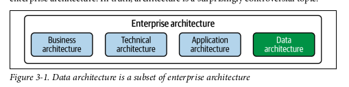
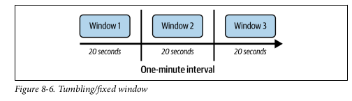

# Fundamentals Of Data Engineering
Joe Reis, Matt Housley
July 2022

## Part I: Foundation and Building Blocks

### Chapter 01: Data Engineering Described

#### What is Data Engineering

- Data engineering is the development, implementation, and maintenance of systems and processes that take in raw data and produce high-quality, consistent information that supports downstream use cases, such as analysis and machine learning. Data engineering is the intersection of security, data management, DataOps, data architecture, orchestration, and software engineering. A data engineer manages the data engineering lifecycle, beginning with getting data from source systems and ending with serving data for use cases, such as analysis or machine learning.

- Data Engineering vs Data Science
    - DE = Upstream; DS = Downstream 

- Data Science Hierarchy of Needs

- Data from various sources -> Data Engineering -> data Science and analysis

#### Data Engineering Skills and Activities

- Balancing of Data Engineering
    - Cost
    - Agility
    - Scalability
    - Simplicity
    - Reuse
    - Interoperability

- Simplified Data Maturity Model for this book
    1. Starting w/ Data
    2. Scaling w/ Data
    3. Leading w/ Data

- DE Business Responsibilities
    - Know hoe to communicate w/ nontechnical & tech peeps
    - Understand how to scope and gather Business and product requirements
    - Understand the cultural foundation of Agile/DevOps/DataOps
    - Control costs
    - Learn COntinuously

- DE TEch Responsibilities
    - Security
    - Data Management
    - DataOps
    - Data Architecture
    - Orchestrations
    - Software Engineering

- Continuum of DE
    - Type A - Abstraction: uses COTS, doesn't reinvent the wheel
    - TYpe B - Build: build tool and systems; level 2 or 3 in maturity

#### Data Engineering Inside and Org

- Upstream stakeholders
    - Data Architects
    - SEs
    - DevOps and SREs
- Downstream stakeholders
    - Data scientists
    - Data Analysts
    - ML/AI engineers/researchers

- Companies don’t hire engineers simply to hack on code in isolation. To be worthy of their title, engineers should develop a deep understanding of the problems they’re tasked with solving, the technology tools at their disposal, and the people they work with and serve.

### Chapter 02: The Data Engineering Lifecycle

- 5 Phases
    1. Generation
    2. Storage
    3. Ingestion
    4. Transformation
    5. Serving Data

- Data ENgineering lifecycle is a subset of the  Data Lifecycle

#### Phase 1 Generation
- SOurce systems is the origin of data used in the DE lifecycle
    - Evaluating source system: Key considerations
        - What are the essential characteristics of the data sources? Is it an app? a swarm of IoT devices?
        - How is data persisted in the sources system" is data persisted long term or temporary? 
        - At what rate is data generated? How many events/s? GB/hour?
        - What level of consistency can DE expect from output data? if you are running data-quality checks against output data, how often do inconsistencies occur? - nulls, bad formatting, etc. ? 
        - How often do errors occur? 
        - Will the data container duplicates? 
        will some data values arrive late? Possible much later than other messages produced simultaneously? 
        - what is the schema of the ingested data? will DE need to join across many tables or even many system to get a complete picture of the data? 
        - if schema changes, how is this dealt w/ and communicated downstream
        - how frequently should data be pulled from the source system? 
        - For stateful systems, is data provided as periodic snapshots or updated events from change data capture (CDC)? What is the logic for how changes are performed and how are these tracked in the source database? 
        - Who/what is the data provider that will transmit the data for downstream consumption? 
        - will reading from ta data source impact its performance? 
        - Does the source system have upstream data dependencies? what are the characteristics of these upstream systems? 
        - Are data quality check in place to check for late or missing data? 

#### Phase 2 Storage
- where is the data going to be stored

- Evaluating storage systems
    - Considerations
        - Is the storage solution compatible w/ the architecture required write and read speeds? 
        - Will storage create a bottleneck for downstream processes? 
        - Do you understand how this storage tech works? Are you utilizing the storage system optimally or committing unnatural acts; i.e. are you applying a high rate of random access updates in an object storage?
        - Will the storage system handle anticipated future scale? i.e. total available storage, read operation rate, write volume, etc.
        - will downstream users and process be able to retrieve data in the required SLA
        - Are you capturing metadata about schema evolution, data flows, data lineage and so forth? metadata has a significant impact on the utility of the data and represents an investment in the future; dramatically enhancing discoverability and institutional knowledge to streamline future projects and architecture changes
        - is this a pure storage solution (obj store) or does it support complex query patterns (cloud data warehouse) 
        - Is the storage system schema-agnostic (obj store), flexible schema (Cassandra), enforced schema (cloud data warehouse) 
        - How are you tracking master data, golden records data quality, and data lineage for data governance? 
        - How are you handling regulatory compliance and data sovereignty? i.e. can you store data in a certain geographic region? 

- Data Access Frequency
    - Hot or Cold data?

#### Phase 3 Ingestion

- Evaluating Ingestion systems
    - Consideration for Ingestion
        - What are the use cases for the data I'm ingesting?
        - Can I reused this data rather than create multiple version fo the same dataset? 
        - Are the system generating and ingesting the data reliably? is the data available when I need it? 
        - What is the data destination after ingestion? 
        - How Frequently will I need to access the data? 
        - In what volume will the data typically arrive? 
        - What format is the data in? Can my downstream storage and transformation systems handle this format? 
        - Is the sources data in good shape for immediate downstream use? if so, for how long and what may cause it to be unusable? 
        - if the data is from a stream sources, does it need to be transformed before reaching its destination? Would an inflight transform be appropriate (transform the data within the stream)

- Batch Vs streaming
    - streaming for real, near real time (sub 1s) 
    - Batch in constrained by how data is batched
    - choice is based on cost and data timing requirements
    - COnsiderations for batch vs streaming
        - If I ingest the data in real time, can downstream storage system handle the rate of data flow? 
        - DO I need sub 1s data ingestion? WOuld micro batch work (every minute)?
        - what are my use cases for stream ingestion? what specific benefits do I realize by implementing streaming? if I get data in real time, what action can I take on the data that would be an improvement on batch? 
        - will my streaming-first approach cost more in terms of time, money, maintenance, downtime and opportunity cost rather than simple doing batch? 
        - Are my streaming pipeline and system reliable and redundant if infra fails? 
        - what tools are most appropriate for the use case? Managed services or deploy own instances? Who will manage? 
        - If deploying ML Model, what benefits do I have with online predictions and possible continuous training? 
        - Am I getting data from live prod instances? if so, what is the impact of my ingestion process on the source system? 

- Push vs Pull 
    - push = source system writes data out to a target
    - pull = data is retrieved from the sources system

#### Phase 4 Transformations

- Evaluating Transformation systems
    - Considerations
        - What is the cost and ROI of the transform? What is the associated business value? 
        - Is the transformation as simple and self-isolated as possible? 
        - What business rules do the transformation support? 

- Transforms can be in aby part of the data lifecycle
- Business logic is the main driver for transformation
- Data featureization for ML = extract and enhance data features useful for ML

#### Phase 5 Serving Data
Getting value from the data
- Data has value when used for a purpose

Analytics is the core of most data endeavors
- Operationally
    - fine grained details of operations, real time dashboards
- Business Intelligence, ad hoc
    - Describe business past and current state
- Embedded
    - customer facing
    - similar to BI, but w/ different, often more demanding requirements

Serving data for ML Considerations
- Is the data sufficient quality to perform reliable feature engineering? Quality requirements and assessments are developed in close collaboration w/ teams consuming data? 
- Is the data discoverable? and data scientists and ML Engs easily find valuable data? 
- Where are the technical and organization boundaries between data eng and ML eng? this question has significant architecture implications. 
- Does the data set properly represent ground truth? is it biased? 

Reverse ETL
- Takes processed data from the output side of the data engineering lifecycle and feeds it back into the sources 

#### Major Undercurrents Across the Data Eng Lifecycle

Security
- IAM and timing, right data to right systems for the right amount of times

Data Mgmt
- "Data management is the development, execution, and supervision of plans, policies, programs, and practices that deliver, control, protect, and enhance the value of data and information assets throughout their lifecycle."
- facets of Data mgmt
    - data governance, including accountability and discoverability 
        - ENsures quality, integrity, security and usability of the data
        - Metadata types for discoverability 
            - Business metadata: the way the data is used in the business; including data definitions, data rules and logic, how and where data is used, and data owner
            - Technical metadata: describes te data created and used by systems across the Data eng lifecycle; includes data model and schema, data lineage, field mappings, and pipeline workflows. 
            - Operational metadata: operational results of various system and includes stats about the process, job ID, app runtime logs, data used in process and error logs
            - Reference metadata: used to classify or look up data including geo codes, internal codes, measurement units
        - Accountability means who governs a potion of the data
    - data quality
        - 3 characteristics
            - Accuracy: is the data factually correct? are the duplicates? are numeric values accurate
            - Completeness: are records complete? do all required fields contain valid values
            - Timeliness: Are records available in a timely fashion.
        - COnsider nuance
            - avoid misclassifying data
    - data modeling and design: process for converting data into a usable form
    - data lineage: describes the recording of an audit trail of data through its lifecycle, tracking systems and upstream data it depends on
    - storage and ops
    - data integration and interoperability: process of integrating data across tools and process
    - data lifecycle mgmt: 
    - data system for advanced analytics and ML
    - Ethics and privacy

DataOps
maps best practices of Agile, DevOps, and statistical process control to data to improve release and quality of data. 

- 3 core tech elements
    - Automation
        - orchestration frameworks like Airflow or Dagster
        - CI/CD
    - Observability and Monitoring
        - avoid bad data
        - Data Observability Driven Development (DODD)
    - Incident Response
        - a way to fix mistakes quickly

Data Architecture

Orchestration

Software Engineering

### Chapter 03: Designing Good Data Architecture

#### What is Data Architecture
before defining, define Enterprise Architecture: 

Enterprise architecture is the design of systems to support change in the enterprise achieved by flexible and reversible decisions reached through careful evaluation of trade-offs

- Change Management is related to reversible decisions and is a central them of enterprise architecture frameworks

**Data architecture** is the design of systems to support the evolving data needs of an enterprise, achieved by flexible and reversible decisions reached through careful evaluation of trade-offs
- operational architecture is the functional requirements related to people process, and tech. 
- technical architecture outlines how data is ingested, stored, transformed and served along the data engineering lifecycle

#### Principles of GOod Data Architecture

Principle 1: Choose common components wisely
- storage, SCM, observability, monitoring, and orchestration systems

Principle 2: Plan for failure
- Availability: % time is operable
- Reliability: probability of a system meeting define standards in performing its intended function during a specified interval
- REcovery Time objective
- Recovery Point Objective

Principle 3: Architect for scalability
- Scale up and down

Principle 4: Architecture is leadership
- architects should be competent and make good choices

Principle 5: always be Architecting
- start w/ baseline (current Arch)
- plan for target, mapping out sequence to get there

Principle 6: Build loosely couple systems
- re: Amazon's API mandate
- Loose couple people and technology systems

Principle 7: Make reversible decisions
- No 1 way doors; find ways to avoid irreversible decisions

Principle 8: Prioritize Security
- hardened perimeter
- Zero trust 
- Shared responsibility

Principle 9: Embrace FinOps
- Look for cost optimizations
- Maximize value

#### Major Architecture Concepts
Domain: is the real world subject area for which we are architecting. 
Service: is a set of functionality whose goal is to accomplish a task
- Domains can contain many services; they may share services

Use distributed systems to enable: 
- scaling (horizontal and vertical)
- Elasticity (scale dynamically) 
- Availability
- Reliability

Loose couple over tight couple
-use tiers
    - Data -> App/Logic -> Presentation
- avoid monoliths
- use microservices

Other considerations
- User access: Single vs Multi tenant
- Event driven architecture

#### Examples

Data Warehouse
- Central data hub used for reporting and analysis
- Highly formatted
- Redshift, BigQuery, Snowflake, etc.

Data Mart
- More refined subset of a Data warehouse to serve analytics, reporting but focused on a single organization, dept or LOB
- Each dept would have its own Data mart specific to it

Data Lake
- No structure to the data
- Very hard to read data out; became a dumping ground

Data Lakehouse
- Controls, management and structure like a warehouse
- while still housing data in object store and supporting flexible query and transform engines

Lambda Architecture
- system operating independent of each other
    - batch, streaming, and service
- source system is immutable and append only, send to different streams
- trad-off is managing multiple systems with different codebases can be error prone

Kappa Architecture
- response to Lambda
- just use stream processing as backbone for all data handling
    - ingest, storage, and serving
- true event based
- realtime and batch supported
- trade-off is it is still complex, expensive

IoT

Data Mesh
- response to sprawling monolithic data platforms
- 4 key components
    - Domain oriented decentralized data ownership and architecture
    - data as a product
    - self-serve data infra as a platform
    - federated computational governance

### Chapter 04: Choosing Technologies Across the Lifecycle
Tactical plan for making technology choices once we have a strategic architecture blueprint
- COnsiderations
    - Team size and capabilities
    - speed to market
    - interoperability
    - Cost optimization and business value
        - total cost of ownership
        - total opportunity cost of ownership
        - FinOps
    - Today vs Future; immutable vs transitory techs
        - recommend a 2 year time horizon to reevaluate tech choices
    - location (on prem/cloud/hybrid/multi-cloud)
        - Don't use Big data tools if you don't need to
    - BUild vs buy
        - know the competitive advantage and where it makes sense to invest
        - They favor OSS by default
        - Don't treat internal operational overhead as a sunk cost
        - Value
        - delivery model
        - Support
        - Releases
        - Sale cycle and Pricing
    - Mono vs modular
        - Avoid monoliths
        - Architect for interoperability
        - Avoid easy to get into, painful to get out of trap
        - flexibility
    - Serverless vs servers
        - Serverless until you hit a certain scale
        
        - Workload size and complexity
        - Execution frequency and durations
        - Requests and networking
        - Language
        - runtime limitations
        - Cost
    - Optimization, performance and benchmarks
    - Undercurrents of DE lifecycle

## Part II: Foundation and Building Blocks

### Chapter 05: Data Generation in Source Systems

Data is an unorganized context-less collection of facts and figures.
- Analog data created in the real work: sounds, writing, etc.
- Digital Data created by converting analog or native product of a digital system

Sources Systems
- Files and unstructured data (CSV, TXT. JSON, XML, etc.)
- APIs: standard way pf exchanging data
    - REST
    - GraphQL - query language for app data, alternative to REST; built around JSON
    - Webhooks
    - RPC and gRPC- remote procedure call
- App DB: stores the state of an app; typically an online transaction processing (OLTP)
    - Support for atomic transaction is critical
        Atomic is a set of several changes that are committed as a unit
    - Others are consistency, isolation and durability
- Online Analytical Processing systems
    - run large analytics queries and typically inefficient in handling look ups of individual records
- Change Data Capture (CDC): extracting each change event (insert, update, delete) from a DB
    - used to replicate DBs in near real time or create event stream for downstream
- Logs
    - OS, App, Server, container, network, IoT
    - who, what happened, when 
    - encoded
    - Different resolution or level
- CRUD
    - Create, read, updated, delete
- Insert Only
- Messages and streams
    - time is important w/ streams 
    

Databases
- Considerations for choosing a DB tech
    - DB mgmt system
    - Lookups
    - QUery Optimizer
    - Scaling distribution
    - Modeling Patters
    - CRUD
    - COnsistency
- Types of DBs
    - Relational
    - Nonrelational
    - Key Value stores
    - Document Stores
    - Wide COlumn - optimized for massive amounts of data w/ high transaction rates and low latency
    - Graph - store data w/ a mathematical graph structure
    - Search - Nonrelational DB to search your data's complex and straightforward semantic and structural characteristics
    - Time series

Data Sharing

3rd party Data Sources

Message Queues and Event Stream Platforms
- Considerations
    - Message ordering and delivery
    - Delivery Frequency
    - Scalability
    - Topics - collection of related events in a stream
    - Stream partitions - subdivisions of a stream into multiple streams
    - Fault tolerance and resilience

### Chapter 06: Storage

Raw ingredients
- Magnetic Disk
- SSD
- RAM
- Networking and CPU 
- Serialization: will inform how well queries perform across network, CPU
- Compression
    - 3 advantages
        - Smaller
        - increase scan speed
        - improved Network performance
- Caching

Data Storage Systems
- Single Machine vs Distributed machines
- Eventual vs Strong COnsistency
    - Basically available: consistency is not guaranteed
    - Soft-state: state of transaction is fuzzy
    - Eventual consistency: at some point, reads will return consistent values
- Files Storage
    - Files have these characteristics
        - finite length
        - append operations
        - Random Access
    - Local Disk vs NAS vs CLoud FS 
- Block storage
    - Access data at the block level for better control of size, scalability and durability
    - RAID
    - Storage Area Network (SAN)
    - Cloud Block storage
- Object storages
    - All shapes and sizes of data/files
    - Key value stores
    - key in separating compute and storage
    - great for batch reads/writes
    - not as good for transactional workload
    - gold standard for data lakes
    - enables obj versioning
    - Tiers of storage too
    - Object store backed file systems
- Cache and Memory backed storage systems
    - Memcache and Redis
- Hadoop Distributed file system
- Streaming storage
    - data can be temporal
    - Replay data

- Indexes, Partitioning, and Clustering
    - Columnar serialization allows a DB to scan only the columns required for a particular query
        - COlumnar is bad for transactional, but great for large scan data scans
    - Use partitioning and clustering to reduce what needs to be scanned

Data Engineering storage Abstractions
- COnsiderations
    - Purpose and Use case
    - Update patterns
    - Cost
    - Separate storage and compute
- Data Warehouse
    - Standard for OLAP architecture
    - often used to organize data into a data lake
- Data Lake
    - unstructured
- Data Lakehouse
    - combines lake and warehouse
    - a metadata and file-mgmt layer deployed w/ data mgmt and transformation tools
    - can have good interoperability if data is in open formats

Big Ideas
- Stream to batch
- Data catalog: centralized metadata store for all data across an org
- Data sharing for cross org
- separate compute and storage
- Ephemeral and scalable

Data Storage Lifecycle and Retention
- Hot
- Warm
- Cold

- Value of the data informs retention
- Compliance

### Chapter 07: Ingestion

- Key ENgineering Concepts for the ingestion Phase
    - What is the use case for the data I'm ingesting 
    - Can I reused this data and avoid ingesting multiple versions of the same dataset
    - where is the data going? What's the destination? 
    - What is the expected data volume? 
    - What format is the data in? Can downstream storage and transformations accept this format? 
    - Is the sources data in good share for immediate downstream use? that is, is the data of good quality? WHat post-processing is required to service it? what are data-quality resits (e.g. could bot traffic contaminate the data) 
    - Does the data require in-flight processing for downstream ingestion if the data is from a streaming source?

Factors to consider
- Bounded vs unbounded data
    - assume all data is unbounded until it is bounded
    
- frequency
    
- synchronous vs asynchronous
    
    
- serialization and deserialization
    - serialization means encoding the data from a sources and preparing data structure for transmission and intermediate storage stages
- throughput and scalability
- reliability and durability
- payload
    - kind of data (video, image, text)
    - shape
        - tabular (M rows and N columns)
        - semi-structure JSON (key value pairs) 
        - unstructured Text
        - Images (hight, width, RGB)
        - Uncompressed audio (number of channels, sample depth, sample rate, length) 
    - Size
    - schema and data type
    - detecting and handling upstream and downstream changes
    - schema registries
    - Metadata
    - 
- push vs pull vs poll

Batch COnsiderations
- Time interval based
- Size based

Batch ingestion patters
- SNapshot or differential extraction
    - full or incremental
- File base export and ingestion
- ETL vs ELT 
    - extract: getting data from the source system
    - Load: into storage destination
    - Transform
- Inserts, Updates and batch size
    - Batch typically performs better w/ larger sizes of inserts/updates
- Data Migration

Message and stream ingestion COnsiderations
- schema evolution
- Late arriving data
- ordering and multiple delivery
- replay
- time to live
- message size
- Error handling and dead-letter queues
- Consumer pull and push
    - pull is default for most DE apps
- Location

Ways to ingest
- Direct DB Connection
- Change Data Capture
    - Batch CDC
    - Continuous CDC
    - CDC and replication
    - CDC Considerations
        - resources
        - batches can cause excessive loads
- APIs

DO not reinvent the wheel
- Data connectors probably already exists

Moving data w/ Obj Storage
- electronic data interchange (EDI) - Data movement method
- DB and File exports
- shell
- ssh
- SFTP and SCP
- Webhooks
    
- Web interface
- Web Scripting

Practical Issues w/ Common file formats
- CSV is error prone
- Parquet, Arrow, Avro, ORC are better
    - but newer and may not be native

Transfer Appliance for Data migrations
- a box to move 100TBs instead of over the network

### Chapter 08: Queries, Modeling, and Transformation

Queries
- allow you to retrieve and act on data
- Data definition language (DDL)
    - CREATE, DROP, UPDATE
- Data manipulation language
    - SELECT, INSERT, UPDATE, DELETE, COPY, MERGE
- Data control language
    - GRANT, DENY
- Transaction control language
    - COMMIT, ROLLBACK

Life of a Query

QUery Optimizer
- optimized your join strategy and schema
    - Join types: inner, outer, left, cross
    - Join relationships: 1:1, 1:many, many:1, many:many
    - Try to pre-join data that is often queried
    - understand how your query optimizer handles joins
    - Use Common table expressions instead of nested subqueries or temporary tables
- Use the explain plan and understand your query's performance
    - EXPLAIN command
    - Areas to monitor
        - Resources: disk, mem, and network
        - Data loading time vs processing time
        - query execution time, number of records, the size of the data scanned and the quantity of the data shuffled
        - competing queries that might cause resource contention in your DB
        - number of concurrent connections used vs connection available. Oversubscribed concurrent connection can have a negative effects on users
- Avoid full table scans (SELECT *)
- Know how DB handles commits
- Vacuum dead records (removing dead records)
- Leverage cached queries

Queries on streaming data
- Basic query patterns on streams
- fast follower approach

- Kappa Architecture
- WIndows, triggers, emitted stats, and late arriving data
- Session WIndow

- Fixed time windows

- SLiding Windows

- Watermarks

- COmbining streams with other data
- COnvention table joins

- Enrichment

- stream to stream joins

Data Modeling
- avoid jumping into building data systems w/o a plan to organize data in a way that is useful
- A data model represents the way data relates to the real world. It reflects how the data must be structured and standardized to best reflect your orgs' processes, definitions, workflows and logic

    - Conceptual
        - contains business logic and rules and describes systems data such as schema, tables and fields
        - Entity relationship diagram
    - Logical
        - details how the conceptual model will be implemented in practice by adding significantly more detail
    - Physical
        - defines how the logical model will be implemented in a DB system
- Normalization is a DB data modeling practice that enforces strict control over the relationships of tables and columns withing a DB. The goal is to remove redundancy of data and ensure referential integrity
    - 4 main objective
        - to free the collection of relations from undesirable insertion, update and deletion dependencies
        - to reduce the need for restructuring the collection of relations as new types of data are introduced and thus increase the lifespan fo the app programs
        - to make the relational model more informative to users
        - to make the collection of relations neutral to the query stats , where these stats are liable to change as time goes on
    - Normal forms:
        - Denormalized: no normalization, nested and redundant data is allowed
        - First normal form (1NF): each column is unique and has a single value. The table has a unique primary key
        - second normal form (2NF): 1NE + partial dependencies are removed
        - third  normal form (3NF): 2NF + each table contains only relevant fields related to its primary key and has no transitive dependencies

Techniques for modeling batch analytical data
- Inmon
    - Subject oriented: i.e. sales, marketing
    - integrated: data from disparate sources are consolidated and normalized
    - nonvolatile: data remains unchanged after stored
    - time-variant: varying time ranges can be queried
- Kimball

    - data is modeled w/ 2 general types of tables
        - fact tables: quantitative and event related data.
            - immutable
            - should be lowest grain possible
        - dimensions: qualitative data referencing facts
            - when joined to a fact table, dimension tables describe what, where and when
            - Denormalized
    - Combined to make a star schema
- Data vault

    - separates structural aspects of a source system's data from its attributes
    - load data into a handful of purpose built tables in an insert only manner
    - 3 types of tables
        - Hubs: stores business keys
        - Links: maintains relationships among business keys
        - Satellites: represent business keys attributes and context
    - wide Denormalized tables: many fields and denormalized data

Modeling Stream Data
- Nothing defined yet

Transformations
- manipulate, enhance, and save data for downstream use, increasing its value in a scalable, reliable and cost effective manner
- different from a query
    - a query retrieved the data from various source based on filtering and join logic
    - a transform persists te results for consumption by additional transformation or queries
        - may be ephemerally or permanently stored
- transforms rely on orchestration

- Batch transforms: run on discrete chunks of data
    - patterns:
        - Distributed joins: we need to break a logical join into much smaller node joins that run on individual service in the cluster.
        - Broadcast join: generally asymmetric w/ 1 large table distributed across nodes and 1 small table that can easily fit on a single node. The query engine broadcasts the small table to all the nodes we it joins parts of the large table
        
        - Shuffle has join: if neither table is small enough to fit on a single node, the query engine will use shuffle hash
        
        - ETL, ELT, data pipelines

    - SQL and Code-based transformation tools
        - SQL first class citizen
        - SQL declarative
        - When to avoid SQL for batch transforms?
            - How difficult is it to code the transform in SQL?
                - The more complex, the more likely you should use code instead
            - How readable and maintainable will the resulting SQL be?
            - Should some of the transformation code be pushed into a custom lib for further reuse across the org?
                - SQL doesn't use libs
    - Update Patterns
        - transforms often persist data in place, so updates can be a pain
        - Truncate and reload - clear the table of old data, and new output from transform is loaded.
        - insert only: leave old records and insert new ones.
            - can maintain current view of data.
            - downside is it is computationally expensive to find the latest record at query time
        - delete
            - In columnar data, deletes are more expensive than inserts
            - Hard delete permanently delete record
            - soft delete marks record as deleted, but isn't
            - insert deletion: inserts a new record w/ delete flag to support Insert only update pattern
        - Upsert/merge
            - takes a set of source records and looks for matches against a target table by using a primary key or other logical condition.
            - When a match occurs, the targe record gets updated w/ new record
            - if no match, a new record is created
            - huge performance impacts for columnar
    - Schema updates
        - easier to update schema than data in columnar
    - Data wrangling: takes messy, malformed data and turns it into useful clean data
        - Usually a batch process
        - think IDE for malformed data
    - Business logic and derived data
        - most common use case for transformations
    - MapReduce
        - viewed as powerful, but very rigid

Materialized views, federation and query virtualization
- Views: a DB object that we can select from a table. when we select a view, the DB creates a new query that combines the view's subquery with our query.
    - Help in security, create the view instead of added access to operator
    - Help w/ common access patterns
- Materialized Views: does pre-computation that the regular view does not; sort of cached
    - significant query optimization
- Composable Materialized views
    - In general, materialized views are not composable, but there can be now
- Federated queries: DB feature that allows the OLAP db to select from an external data sources such as obj store or RDBMS

- Data virtualization
    - relates to federated queries, but typically entails a data processing or query system that doesn't store the data internally
    - good solution when data is stored across various data sources

- streaming transforms: run on data as it arrives
    
    - transforms and queries are a continuum
    - streaming DAG
    
    - micro batch vs true streaming
        - understand the cost and requirements to decide

### Chapter 09: Saving Data for Analytics, ML, and Reverse ETL

Considerations for Serving Data
- Trust: end users must trust the data they are receiving
- What is the use case and who is the user?
    - Who will use the data
    - how will they use it?
    - what do stakeholders expect
    - How can I collaborate w/ data stakeholders to understand how they data i'm working with will be used
- Data product
    - Jobs to be done w/ data
    - considerations
        - when someone uses the data product, what do they hope to accomplish?
        - will the data product serve internal or external users?
        - what are the outcomes and ROI of the data product you are building?
- Self-service or not
    - How will user interface w/ your data products?
    - Goal is to make data available and the user self serve
- Data Definitions and Logic
    - data definition is the meaning of the data as it is understood by the organization
    - Data logic stipulates formulas for deriving metrics from data

Analytics: Discovering, exploring, identifying, and making visible key insights and patterns within data
- Business Analytics: uses historical and current data to make strategic and actionable decisions
    - Dashboards, reports and ad hoc analysis
- Operational Analytics: use data to make immediate actions
    - Operational analytics versus business analytics = immediate action versus actionable insights
    - time is the big difference
- Embedded Analytics
    - external facing, end user facing
- Machine learning
    - areas a data eng should be familiar with
        - DIfference between supervised, unsupervised and semi-supervised learning
        - difference between classification and regression techniques
        - Various techniques for handling time-series data; including analysis and forecasting
        - when to use classical techniques (logistic regression, tree-based learning, support vector machines) versus deep learning. Avoid jumping to deep learning when it is overkill
        - When would you use automated ML vs handcrafting an ML Model? Tradeoffs?
        - what data wrangling techniques used for structured and unstructured data
        - all data that is used for ML is converted to numbers. ensure proper conversion
        - how to encode categorical data and embeddings for various types of data
        - DIfference between batch and online learning
        - how does Data eng lifecycle intersect w/ ML at your company
        - know when it is appropriate to train locally, on a cluster, or at the edge. GPU or CPU?
        - Know the difference between the apps of batch and streaming data in training ML models
        - What are data cascades and how might they impact ML models
        - Are results real time or batch?

Ways to serve data for analytics and ML
- FIle exchange
- Databases
- Streaming systems
- query Federation
- Data Sharing
- Semantic and Metrics layers
    - metrics layer is a tool for maintaining and computing business logic
    - semantic layer
- Serving data in notebooks (like Jupyter)
- Reverse ETL

### Chapter 10: Security and Privacy
People
- Always be paranoid

Processes
- Security theater vs security habit
    - avoid focus on compliance for compliance sake
- Active security
- Principle of least privilege
- Shared responsibility in the cloud
- Always back up your data

Technology
- Patch and update systems
- Encryption
    - at rest
    - over the wire
- logging, monitoring, and alerting
    - Access, resources, billing, excess permissions
- Network Access

### Chapter 11: The Future of Data Engineering

- Lifecycle isn't going away
- Decline of complexity and rise of easy to use data tools
- cloud scale data OS and improved interoperability
- "Enterprisey" data engineering
- Moving away from the modern data stack and toward the live data stack
    
    - Streaming pipelines and Real-Time Analytics
- Fusion of data w/ Apps
- Tight feedback between apps and ML
