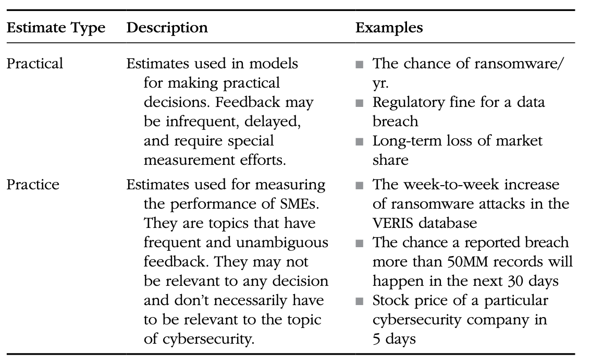

# Chapter 7: Calibrated Estimates

research shows:
1. Most people are bad at assigning probabilities
2. most people can be trained to be very good at it.

A cybersecurity expert can learn how to express their uncertainty with a subjective—but quantitative— expression of uncertainty.

Two types of Subjective Probability assignments use in the simple 1 for 1 substitution model:

* discrete binary (aka Bernoulli) - An either/or type of event, it happens or doesn’t, expressed as a probability the event will occur
** coin flip
** data breach happens in a given time
** system goes down
** 5% chance next of a data breach of PHI that will be required to be reported

* continuous - A quantity with a range of possible values, expressed as a range with a probability
of containing the answer.
** SIze of the future data breach
** duration of a system outage
** change in sales due to past data breach
** 90% probability that the duration of the system outage is between 30min and 4h

If this event does not occur, was the probability “right”? Clearly with a probability that is much less than 50% we weren’t expecting the event to occur, anyway. But a single event doesn’t determine whether a stated prob- ability was right or wrong. We can only look at a number of data points. We can ask, “Of the large number of events we assigned a 5% probability to for a given year, did about 5% actually occur?” Likewise, where we thought an event was 20% or 1% likely in that same time period, did the event occur 20% or 1% of the time, respectively?

Either over of under confident

In short, researchers discovered that assessing uncertainty is a general skill that can be taught with a measurable improvement.

Sample CI questions
1. LB:80, UB: 250
2. LB: 1100, UB: 1600
3. LB: 7 ,UB: 11
4. LB: 1983, UB: 1995
5. LB: 1300, UB: 1700
6. LB: 3k, UB: 8k
7. LB: 50% UB: 90%
8. LB: 18 UB: 50
9. LB: 0.1, UB: 2
10. LB: 1/1/85 UB: 1/1/1995

(1) 203 (2) 1685 (3) 8.9 (4) 1969 (5) 1564 (6) 2,446 (7) 78.5% (8) 88 (9) 0.56 (10) 1964

Sample Binary questions
1. F 50% 
2. F 70% (way off)
3. F 100% (way off)
4. F 90%
5. F 60%
6. T 50%
7. F 60%
8. T 80%
9. T 50%
10. T 100% 

(1) True (2) True (3) True (4) False (5) True (6) True (7) False (8) True (9) False (10) True

## Beyond Initial Calibration Training: More Methods for Improving Subjective Judgment

* Practice Estimates

* Reducing Inconsistency

* Aggregating Experts