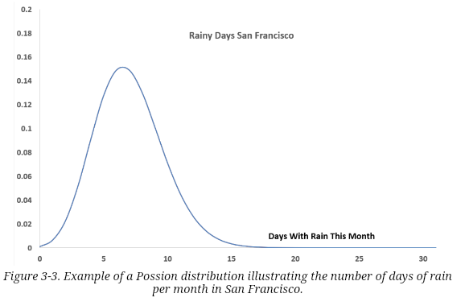
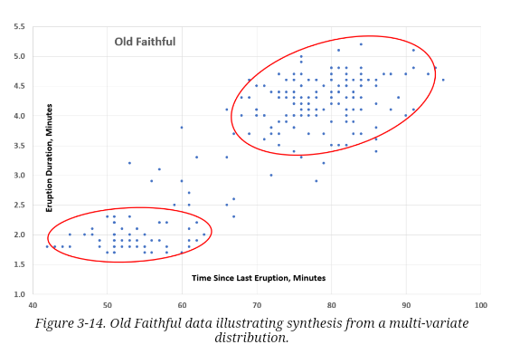
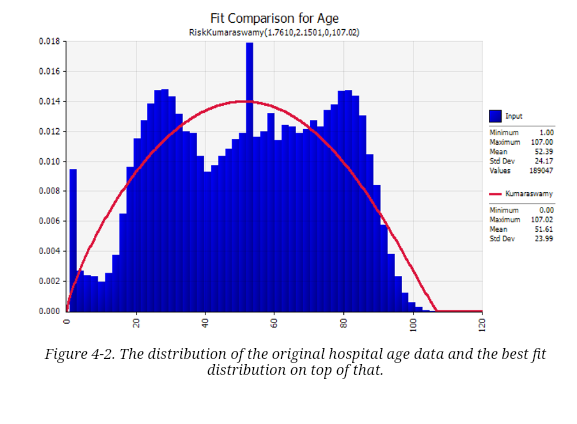

# Practical Synthetic Data Generation
Khaled El Emam, Lucy Mosquera, Richard Hoptroff
June 2020

## Chapter 01: Introduction

### Defining Synthetic Data

What is Synthetic Data
- data generated from real data that has the same statistical properties as the real data.
- this means if an analyst works w/ synth data they should similar results as working w/ real data
- 2 types of synth data
    - synthesized from real datasets: build a model to capture the distributions and structure of that real data. (structure means the multi-variable relationships and interaction in the data)
    - not synthesized from real datasets: Created by using existing models or by using background knowledge of the analyst.  
       
        

Benefits of Synthetic Data
- Access to data for a secondary purpose is problematic
- Privacy concerns
- Access to datasets can be hard
    - Public datasets  may lack diversity
- Real data may not exist
- Most common is privacy and commercial sensitivity reasons prevent access
- Synth data can significantly accelerate AI/ML initiatives
    - can be used to train initial model before it is used on the real data set 

Learning to trusted the Synthetic Data
- In the 90s, synth data was generated w/ proposals to use multiple imputation methods
    - Imputing realistic data when there was missing data
    - analyst must know how the data will be used
    - if the model is different, synth data will not reflect real data
- Statistical machine learning models are used for data synth
    - advantage is they can capture the distributions and complex relationships among variables
    - W/ deep learning synthesis, models can be accurate

Other approaches to access data for AIML projects 
- De-identification
    - Transform to remove PII
    - Works well w/ clearly defined methodologies
    - Lots of manual intervention and additional controls
    - 
- Secure multi-party computation
    - allows computations to be performed on encrypted data and typically involves multiple independent entities that perform that computation collaboratively w/o sharing or leaking raw data among themselves
    - Ways to do this
        - secret sharing techniques: Data is randomly split among the collaborators
        - homomorphic encryption techniques: data are encrypted and computations are performed on the encrypted values

Synthetic Data Case Studies
- Very difficult to de-identify complex datasets
    - re-identification attacks are a thing

## Chapter 02: Implementing Data Synthesis
2 components to implement Data synthesis
- Process
    - steps and how to integrate synthesis in to a data pipeline
- structure
    would be operationalized through a synthesis center of excellence

### Data Synthesis Projects
Steps

- Start w/ Real data
- Synthesize
- Utility assessment provide assurance to data consumers that the data utility is acceptable & build trust w/ synthesized data
    - 2 stages
        1. general purpose comparisons of parameters calculated from real and synth. i.e. comparisons of distributions and bivariate correlations. (smoke tests) 
        2. Workload aware: analysis of synth data that are similar to the types of analysis that would be performed on real data
- Privacy Assurance assessment: evaluates the extent real people can be matched to records in the synth data and how easy it would be to learn something new if matches are correct

Data Preparation
- Before synthesis, data likely needs to be prepped
    - data Cleansing to remove errors in the data
    - data Standardization to ensure that all fields are using consistent coding schemes
    - data harmonization to ensure the data from multiple sources are mapped to the same data dictionary
    - linking data from multiple sources
        - it is not possible to link synthetic data b/c the synth data do not match real people
    - data shaping
        - i.e. attribute value pairs are difficult to work w/ in standard statistical analysis tools, and maybe reshaped to tabular

### The Data Synthesis Pipeline
simple 1 line pipeline: 

Likely not that simple; 3rd parties involved

even more complex w/ multiple data sources

then, max complexity w/ multiple data sources & 3rd parties doing prep and synth

or just synth

pipeline will depend on
- Number of data sources
- costs and readiness of data analyst
- availability of trusted 3rd parties
- ability to implement automation 

### Synthesis Program Management

Start a Center of Excellence at your company

### Best Practices for Implementing Data Synthesis

- Change how analyst and leadership to use synth data 
- Have enough compute capacity to synthesize
- Synthesize cohorts (subsets) vs full Datasets
    - it is easier to synthesize the full dataset over the each cohort.
    - Data utility is usually higher too
    - Synthesize data as it comes in, not goes out
- Perform validation studies to get buy in
    - Validation study shows a study on synth data will yield similar results as real data
    - Include validation steps in pipeline
    - Make sure to choose a relevant validation study. Not too hard or simple

## Chapter 03: Getting Started: Distribution Fitting

Starting point on modeling distributions is understanding how to fit individual vars to know distributions (or classical distributions like the normal and exponential)
- Once we do that, we can generate data from these distributions that have the same characteristics as the original data

Next step is model non-classical distributions

n == Framing Data Any data analysis task begins w/ a pile of data that needs to be trandormed into a data frame
- data frame is a table of data where each row is a complete self contained example of the data being represented
    - column (variable or field) is a detail about thr row 
- framing the data is hard
    - cannot have errors or exceptions
    - relational data must be unfolded into the fram by joins
    - missing data needs to be estimated

Then, model the data frames' distributions and probabilities
- We have to ensure privacy; that is real data cannot be interpolated from synth data

### How is Data Distributed
individual data vars can have many types of distributions
- Unbound real numbers: -infinity to +infinity, Gaussian or normal distribution
    
- Bound real numbers: w/ definite upper and lower bound, Bayesian probabilities ranging from 0 to 1; useful for expressing the likelihood of an estimate 
    
- Non-negative numbers: Poisson distributed counts of even from 0 to n
    
- Logarithmic distributions: integers or real numbers and tend to reflect physical systems w/ multiplicative effects; Benford's distribution of first digits in accounting numbers
    
- Binomial integers: model the number of success from a series of indenpendant experiments; probability of heads in 10 flips
    
- non-classical distributions: based on physical realities; i.e. hospital discharge data
    
- factor or category data: have a definite number of categories
    
    - different to other types b/c factor's relationship w/ other factors is not linear
        - may have a sequence
        - quasi-sequence (Sun-Sat, but w/ holidays) 
        - no sequence (red, blue, green) 
    - To work w/ established analytical techniques, factor data needs to be turned into numbers
        - an approach is to split the factor into multi vars, one for each factor; challenge is the result has a large number of new vars being added to the data set
        - Binary encoding is more efficient
            - each facto is encoded w/ its binary equivalent. (5 different values, then the third is 011)
- Time series data: probability distribution for the current record depends on an earlier measurement
    

### Fitting Distributions to Real Data
Modeling univariate distributions id often not enough

Images show univariate

generated synth data that doesn't match

but multivariate removes the unintended ellipses

### Generating Synthetic Data from a Distribution
If the fitted distribution is a known of classical one, and the fitting process has determined the distribution parameters, then synthetic data can be generated using the Monte Carlo methods

The brute force approach to generating synth data from non-classical distributions is straightforward: Generate randomized data points evenly across te data range, or as probability suggests, and adopt/reject it according to whether it improves the fit to the distribution.

### Measure How Well Synth data fits a distribution
for single variate, the CHi-square and the Kolmogorov-Smirnov (KS) Test
- KS is robust b/s it looks at the difference between cumulative probability and the cumulative data count

- KS measure is the area between the two curves
- Extending KS to multiple dimensions is tricky: define cumulative across multi-variate
    - one approace is to use the dataset as a guide; limit measurement to where data exists.

The Overfitting Dilemma

- the fit can be improved by using models with more vars

the spike at 50 cannot be justified, so this is over-fit

The problem with overfit is a model will not work with new data
- Also, with anonymized data, overfitting can give away original data.

To solve: 
- use an approach that allows the distribution to start from a neutral point and journey slowly to closer and closer fit to the data; trading off between simplicity of distribution and goodness of fit at each step. 
- Then measure to know when the best trade-off point is reached

A measure to know when the best trade off point has been reached requires a subsample approach. We need to measure how representative the data is of the distribution it comes from. We cannot do that without more data to compare to, so the next best thing: 
- hold back some data and see how well it fits to the distribution created with the rest of the data

In this example, optimal fir is at 50 steps

## Chapter 04: Evaluating Synthetic Data Utility

To achieve widespread use and adoption, data synthesizers need to ensure that synth data has sufficient utility to produce similar analysis results as the original data. 

### Synthetic Data Utility Framework
beneficial because it allows
- Data synthesizer to optimize their generation methods to achieve high data utility
- different data synthesis approaches to be consistently compared by users choosing among data synthesis methods
- data users to quickly understand how reliable results from the synthetic data would be

2 approaches to assess the utility of synthetic data
- generic
    - considers the distance between the original and transformed data
    - Good for comparing data synthesis methods
    - difficult to interpret in an absolute sense
- workload aware
    - looks at specific feasible analyses that would be performed on data and compares the results between real and synth.

### Comparing Univariate Distributions
determines if the the variable distribution are similar

but when the do not work well... 

It is not practical to generate 2 histograms for every variable and compare

The Hellinger distance can be calculated to measure the difference in distribution between each variable between real and synthetic data
* a probabilistic measure between 1 and 1 where 0 is not difference
* one important advantage is it is bounded, making it easy to interpret
* closer to 0, the better
* it can also be computed for continuous and categorical variables
* many vars can be represented in a box and whisker plot for a good summary

First and second trials are basically identical

### Comparing Bivariate Stats
The absolute difference in correlations between all var pairs in real and synthetic data can be computed as a measure of data utility. 
* type of corelation coefficient will depend on types of vars
    * continuous vars - Pearson correlation coefficient can be used
    * continuous and nominal vars - multiple correlation coefficient
    * continuous and dichotomous vars point biserial correlation is used

### Comparing Multivariate Prediction Models

### Distinguishability
