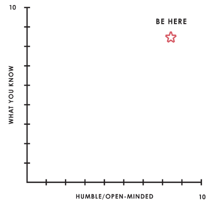

# Principles 
Dalio, Ray
year

Principles are fundamental truths that serve as the foundation for behavior

Pt 1 is Where I am coming from. I am going to skim this quickly

## Chapter 01: My Call to Adventure 49-67

## Chapter 02: Crossing the Threshold 67-79

## Chapter 03: My Abyss 79-82

## Chapter 04: My Road of Trials 83-94

## Chapter 05: The Ultimate Boon 95-10

## Chapter 06: Returning the Boon 11-15

## Chapter 07: My Last Year and My Greatest Challenge 16-17

## Chapter 08: Looking Back From a Higher Level

# Pt 2: Life Principles

## 1. Embrace Reality
Understand it and how it works and how to deal with it. 

1.1 Be a hyperrealist
a. Dreams + reality + determination = a successful life 

1.2 Truth, or more precisely, and accurate understanding of reality, is the essential foundation for any good outcome

1.3 Be radically open-minded and radically transparent
a. they are both invaluable for rapid learning and effective change
b. don't let fears of what others thing stand in your way
c. Embracing both will bring more meaningful work and and relationships

1.4 Look to nature to learn how reality works
a. don't get hung up on your views of how things "should be" because you will miss learning how they really are. 
b. to be "good" something, must operate consistently with the laws of reality and contribute to the evolution of the whole; that is what is most rewarded
c. Evolution is the single greatest force in the universe; it is the only thing that is permanent and it drives everything. 
d. Evolve or Die
    * fail, learn and improve quickly

1.5 Evolving is life's greatest accomplishment and its greatest reward
a. the individual's incentives musth be aligned with the groups goals
b.Reality is optimizing or the whole - not for you
c. Adaptation through rapid trial and error is invaluable
d. Realize that you are simultaneously everything and nothing - and decide what you want to be. 
e.What you will be will depend on the perspective you have. 

1.6 Understand Natures' practical lessons
a. Maximize your evolution
b. Remember, no pain, no gain
c. It is a fundamental law of nature that in order to gain strength one has to push one's limits - which is painful

1.7 Pain + Reflection = Progress
a. Go to the pain rather than avoiding it
b. Embrace tou love

1.8 Weigh 2nd and 3rd order consequences

1.9 Own your outcomes

1.10 Look at the machine from the higher level
a. Think of yourself as a machine operating within a machine and know that you have the ability to alter your machine to produce better output comes
b. By comparing your outcomes with your goals, you can determine how to modify your machine
c. Distinguish between you as the designer of your machine and you are the worker with your machine
d. The biggest mistake most people make is to not see themselves and others objectively, which leads them to bump into their own and others' weaknesses again and again. 
e. Successful people are those who can go above themselves to see things objectively and manage those things to shape change. 
f. Asking others who are strong in areas where you are weak to help you is a great skill that you should develop not matter what, as it will help you develop guardrails that will prevent you from doing what you should not be doing.
g. Because it is difficult to see oneself objectively, you need to rely on the input of others and the whole body of evidence
h. If you are open-minded enough and determined, you can get virtually anything you want. 

## 2: Use the 5 Step Process to Get What You Want Out of Life 

1. Have clear goals
2. Id and don't tolerate the problems that stand in the way of your achieving the goals
3. Accurately diagnose the problems to get their root causes
4. Design plans that will get you around them
5. Do what is necessary to push these designs through to the result 

2.1 Have clear goals
a Prioritize: while you can have virtually anything you want, you can't have everything you want
b. Don't confuse goals with desires
c. Decide what you really want in life by reconciling your goals and your desires
d. Don't mistake the trappings of success for success itself
e. Never rule out a goal because you think it is unattainable
f. Remember that great expectations create great capabilities
g. Almost nothing can stop you from succeeding if you have flexibility and self-accountability
h. Knowing how to deal well with your setbacks is as important as knowing how to move forward

2.2 Id and don't tolerate problems
a. View painful problems as potential improvements that are screaming at you
b. Don' avoid confronting problems because they are rooted in harsh realities that are unpleasant to look at. 
c. Be specific in id'ing your problems
d. Don't mistake a cause of a problem with the real problem
e. Distinguish big problems from small ones
f. Once you Id a problem, don't tolerate it

2.3 Diagnose problems to get at their root causes
a. Focus on the "what is" before deciding "what to do about it"
b. Distinguish proximate causes from root causes
c. Recognize that knowing what someone (including you) is like will tell you what you can expect from them

2.4 Design a Plan
a. Go back before you go forward
b. Think about your problem as a set of outcomes produced by a machine 
c. Remember that there are typically many paths to achieving your goals
d. Think of your plan as being like a movie script in that you visualize who will do what through time. 
e. Write down your plan for everyone to see and measure your progress against
f. Recognize that it doesn't take a lot of time to design a good plan

2.5 Push through to completion
a. Great planners who don't execute their plan, go nowhere
b. Good work habits are vastly underrated
c. Establish clear metrics to make certain that you are following your plan

2.6 Remember that weaknesses don't matter if you find solutions
a. Look at the pattern of your mistakes and identify at which step in the process you typically fail
b. Everyone has at least one big thing that stands in the way of their success; find yours and deal with it. 

2.7 Understand your own and others mental maps and humility

## 3. Be Radically Open-Minded

3.1 Recognize your 2 barriers - ego and blind spots
a. Understand your ego barrier
b. Your 2 "yous" fight to control you
c. Understand your blind spot barrier
    * Do nt fail to benefit from others thinking

3.2 Practice radical open-mindedness
    * you may not be seeing your choices optimally
a. Sincerely believe that you might not know the best possible path and recognize that ability to deal well with "not knowing" is more important than whatever it is you do know.
b. Recognize decision making is a 2 step process: first, take in all the relevant info, then decide
c. Don't worry about looking good, worry about achieving your goal
d. Realize that you cannot put out without taking in
e. Recognize that to gain the perspective that comes from seeing things through another's eyes, you must suspend judgement for a time - Only through empathizing can you properly evaluate another point of view
f. Remember that you're looking for the best answer, not the best answer that you can come up with yourself
g. Be clear on whether you are arguing or seeking to understand and think about which is most appropriate based on your and others' believability
    * peers can argue, if you know less, seek to understand

3.3 Appreciate the art of thoughtful disagreement

3.4 Triangulate your view with believable people who are willing to disagree
a. Plan for the worst-case scenario to make it as good as possible

3.5 Recognize signs of closed mindedness and open mindedness that you should watch out for
* Close minded people: 
    * do not want ideas challenged
    * less questions, more statements
    * focus on being understood instead of understanding
    * "I could be wrong..."
    * Block others from speaking
    * have trouble holding 2 thoughts in the minds
    * lack humility
* Open Minded People: 
    * Curious
    * believe they could be wrong
    * feel compelled to see thing through others eyes
    * know when to make a statement or ask a question
    * more interested in listening than speaking
    * can take in new thoughts without losing ability to think
    * approach everything with fear of they may be wrong

3.6 Understanding how you can become radically open minded
a Regularly use pain as your guide toward quality reflections
    * pain comes from being attached to an idea that challenges it
b. Make being open minded a habit
c. Get to know your blind spots
d. If a number of different believable people say ou are doing something wrong and you are the only one who doesn't see it that way, assume you are biased
e. Meditate
f. Be evidence based and encourage others to be the same
g. Do everything in your power to help others also be open minded
h. Use evidence based decision making tools
i. Know when it is best to stop fighting and have faith in your decision making process

## 4. Understand That People Are Wired Differently 

4.1 Understand the power that comes from know how you and others are wired
a. We are born with attributes that can both help us and hurt us, depending on their application

4.2 Meaningful work and relationships are not just nice things we chose for ourselves - they are genetically programmed into us

4.3 Understand the great brain battles and how to control them to get what "you" want
a. Realize the conscious mind is in a battle with the subconscious mind
b. Know that the most constant struggle is between feeling and thinking
c. Reconcile your feelings and your thinking
d. Chose your habits well
e. Train your "lower level you: with kindness and persistence to build the right habits
f. Understand the differences between right and left brained thinking
g. Understand how much the brain can and cannot change

4.4 Find out what you and others are like
* Myers-Briggs
* Workplace personality indicator
* team dimensions profile
* Stratified system theory
a. Introversion vs extroversion
b. Intuiting vs sensing
c. Thinking vs feeling
d. Planning vs perceiving
e. Creators vs refiners vs advancers, vs executors vs flexors
    * creators generate new ideas
    * Advancers communicate these new ideas and carry them forward
    * Refiners challenge ideas
    * Executors implement
    * Flexors combo of all 4 
f. Focusing on tasks vs focus on goals
h. Shapers are people who can go from visualization to actualization

4.5 Getting the right people in the right roles in support of your goals is the key to succeeding at whatever you choose to accomplish
a. Manage yourself and orchestrate others to get what you want

## 5. Learn How to Make Decisions Effectively

5.1 Recognize that the biggest threat to good decision making is harmful emotions and decision making is a 2 step process (learning and then deciding) 

5.2 Synthesize the situation at hand
a. One of the most important decisions you can make is who you ask questions of
b. Don't believe everything you hear
c. Everything looks bigger up close; step back and gain perspective
d. New is overvalued relative to great
e. Don't over squeeze dots
    * a dot is just one piece of data from one moment in time

5.3 Synthesize the situation through time
a. Keep in mind both the rates of change and the levels of things and the relationship between them
b. Be imprecise
c. Remember the 80/20 rule and know what the key 20% is
d. Be an imperfectionist

5.4 Navigate levels effectively
what it looks like in outline
1. Big Picture: I want meaningful work that's full of learning
1.1 I want to be a doctor
1.1.1 I need to go to med school
1.1.1.1 I need to get good grades in the sciences
1.1.1.1.1 I need to stay home and study tonight

a. User the terms "above the line" and "below the line" to establish which level a conversations is on
* above the line == main points
* below the line == sub points
b. Remember that decisions need to be made at the appropriate level, but they need to be consistent across all levels

5.5 Logic, reason, and common sense are you best tools for synthesizing reality and understanding what to do about it. 

5.6 Make you decisions as expected value calculations
a. Raising the probability of being right is valuable no matter what your probability of being right already is
b. Knowing when not to bet is as important as knowing what bets are probably work making
c. The best choices are the ones that have more pros than cons, not those that don't have any cons at all

5.7 Prioritize by weighing the value of additional information against the cost of not deciding
a. All your "must-dos" must be above the bar before you do your "like-to-dos" 
b. Chances are you won't have time to deal with the unimportant things, which is better than not having time to deal with the important things. 
c. Don't mistake possibilities for probabilities

5.8 Simplify; get rid of irrelevant details

5.9 Use principles
1. slow down thinging to note criteria
2. write criteria as principle
3. think about criteria when you have an outcome to assess
4. refine

5.10 Believability weight your decision making

5.11 Convert your principles into algorithm and have the computer make decisions alongside you.

5.12 Be cautious about trusting AI without having deep understanding

# Pt 3: Work Principles

a. A great org has bot great people and great culture
b. Great people have both great character and great capabilities
c. Great cultures bering problems and disagreements to the surface and solve them well and they love imagining abd building great things that haven't been built before. 

Tough love is effective for achieving both great work and great relationships
a. In order to be great, one cannot compromise the uncompromisable

A believability-weighted idea meritocracy is the best system for making effective decisions

idea meritocracy = radical truth + radical transparency + believability-weighted decisions making 

## 1. Trust in Radical Truth and Radical Transparency