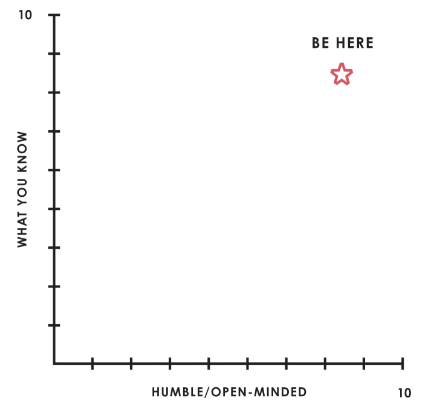

# Principles 
Dalio, Ray
year

Principles are fundamental truths that serve as the foundation for behavior

Pt 1 is Where I am coming from. I am going to skim this quickly

## Chapter 01: My Call to Adventure 49-67

## Chapter 02: Crossing the Threshold 67-79

## Chapter 03: My Abyss 79-82

## Chapter 04: My Road of Trials 83-94

## Chapter 05: The Ultimate Boon 95-10

## Chapter 06: Returning the Boon 11-15

## Chapter 07: My Last Year and My Greatest Challenge 16-17

## Chapter 08: Looking Back From a Higher Level

# Pt 2: Life Principles

## 1. Embrace Reality
Understand it and how it works and how to deal with it. 

1.1 Be a hyperrealist
a. Dreams + reality + determination = a successful life 

1.2 Truth, or more precisely, and accurate understanding of reality, is the essential foundation for any good outcome

1.3 Be radically open-minded and radically transparent
a. they are both invaluable for rapid learning and effective change
b. don't let fears of what others thing stand in your way
c. Embracing both will bring more meaningful work and and relationships

1.4 Look to nature to learn how reality works
a. don't get hung up on your views of how things "should be" because you will miss learning how they really are. 
b. to be "good" something, must operate consistently with the laws of reality and contribute to the evolution of the whole; that is what is most rewarded
c. Evolution is the single greatest force in the universe; it is the only thing that is permanent and it drives everything. 
d. Evolve or Die
    * fail, learn and improve quickly

1.5 Evolving is life's greatest accomplishment and its greatest reward
a. the individual's incentives musth be aligned with the groups goals
b.Reality is optimizing or the whole - not for you
c. Adaptation through rapid trial and error is invaluable
d. Realize that you are simultaneously everything and nothing - and decide what you want to be. 
e.What you will be will depend on the perspective you have. 

1.6 Understand Natures' practical lessons
a. Maximize your evolution
b. Remember, no pain, no gain
c. It is a fundamental law of nature that in order to gain strength one has to push one's limits - which is painful

1.7 Pain + Reflection = Progress
a. Go to the pain rather than avoiding it
b. Embrace tou love

1.8 Weigh 2nd and 3rd order consequences

1.9 Own your outcomes

1.10 Look at the machine from the higher level
a. Think of yourself as a machine operating within a machine and know that you have the ability to alter your machine to produce better output comes
b. By comparing your outcomes with your goals, you can determine how to modify your machine
c. Distinguish between you as the designer of your machine and you are the worker with your machine
d. The biggest mistake most people make is to not see themselves and others objectively, which leads them to bump into their own and others' weaknesses again and again. 
e. Successful people are those who can go above themselves to see things objectively and manage those things to shape change. 
f. Asking others who are strong in areas where you are weak to help you is a great skill that you should develop not matter what, as it will help you develop guardrails that will prevent you from doing what you should not be doing.
g. Because it is difficult to see oneself objectively, you need to rely on the input of others and the whole body of evidence
h. If you are open-minded enough and determined, you can get virtually anything you want. 

## 2: Use the 5 Step Process to Get What You Want Out of Life 

1. Have clear goals
2. Id and don't tolerate the problems that stand in the way of your achieving the goals
3. Accurately diagnose the problems to get their root causes
4. Design plans that will get you around them
5. Do what is necessary to push these designs through to the result 

2.1 Have clear goals
a Prioritize: while you can have virtually anything you want, you can't have everything you want
b. Don't confuse goals with desires
c. Decide what you really want in life by reconciling your goals and your desires
d. Don't mistake the trappings of success for success itself
e. Never rule out a goal because you think it is unattainable
f. Remember that great expectations create great capabilities
g. Almost nothing can stop you from succeeding if you have flexibility and self-accountability
h. Knowing how to deal well with your setbacks is as important as knowing how to move forward

2.2 Id and don't tolerate problems
a. View painful problems as potential improvements that are screaming at you
b. Don' avoid confronting problems because they are rooted in harsh realities that are unpleasant to look at. 
c. Be specific in id'ing your problems
d. Don't mistake a cause of a problem with the real problem
e. Distinguish big problems from small ones
f. Once you Id a problem, don't tolerate it

2.3 Diagnose problems to get at their root causes
a. Focus on the "what is" before deciding "what to do about it"
b. Distinguish proximate causes from root causes
c. Recognize that knowing what someone (including you) is like will tell you what you can expect from them

2.4 Design a Plan
a. Go back before you go forward
b. Think about your problem as a set of outcomes produced by a machine 
c. Remember that there are typically many paths to achieving your goals
d. Think of your plan as being like a movie script in that you visualize who will do what through time. 
e. Write down your plan for everyone to see and measure your progress against
f. Recognize that it doesn't take a lot of time to design a good plan

2.5 Push through to completion
a. Great planners who don't execute their plan, go nowhere
b. Good work habits are vastly underrated
c. Establish clear metrics to make certain that you are following your plan

2.6 Remember that weaknesses don't matter if you find solutions
a. Look at the pattern of your mistakes and identify at which step in the process you typically fail
b. Everyone has at least one big thing that stands in the way of their success; find yours and deal with it. 

2.7 Understand your own and others mental maps and humility

## 3. Be Radically Open-Minded

3.1 Recognize your 2 barriers - ego and blind spots
a. Understand your ego barrier
b. Your 2 "yous" fight to control you
c. Understand your blind spot barrier
    * Do nt fail to benefit from others thinking

3.2 Practice radical open-mindedness
    * you may not be seeing your choices optimally
a. Sincerely believe that you might not know the best possible path and recognize that ability to deal well with "not knowing" is more important than whatever it is you do know.
b. Recognize decision making is a 2 step process: first, take in all the relevant info, then decide
c. Don't worry about looking good, worry about achieving your goal
d. Realize that you cannot put out without taking in
e. Recognize that to gain the perspective that comes from seeing things through another's eyes, you must suspend judgement for a time - Only through empathizing can you properly evaluate another point of view
f. Remember that you're looking for the best answer, not the best answer that you can come up with yourself
g. Be clear on whether you are arguing or seeking to understand and think about which is most appropriate based on your and others' believability
    * peers can argue, if you know less, seek to understand

3.3 Appreciate the art of thoughtful disagreement

3.4 Triangulate your view with believable people who are willing to disagree
a. Plan for the worst-case scenario to make it as good as possible

3.5 Recognize signs of closed mindedness and open mindedness that you should watch out for
* Close minded people: 
    * do not want ideas challenged
    * less questions, more statements
    * focus on being understood instead of understanding
    * "I could be wrong..."
    * Block others from speaking
    * have trouble holding 2 thoughts in the minds
    * lack humility
* Open Minded People: 
    * Curious
    * believe they could be wrong
    * feel compelled to see thing through others eyes
    * know when to make a statement or ask a question
    * more interested in listening than speaking
    * can take in new thoughts without losing ability to think
    * approach everything with fear of they may be wrong

3.6 Understanding how you can become radically open minded
a Regularly use pain as your guide toward quality reflections
    * pain comes from being attached to an idea that challenges it
b. Make being open minded a habit
c. Get to know your blind spots
d. If a number of different believable people say ou are doing something wrong and you are the only one who doesn't see it that way, assume you are biased
e. Meditate
f. Be evidence based and encourage others to be the same
g. Do everything in your power to help others also be open minded
h. Use evidence based decision making tools
i. Know when it is best to stop fighting and have faith in your decision making process

## 4. Understand That People Are Wired Differently 

4.1 Understand the power that comes from know how you and others are wired
a. We are born with attributes that can both help us and hurt us, depending on their application

4.2 Meaningful work and relationships are not just nice things we chose for ourselves - they are genetically programmed into us

4.3 Understand the great brain battles and how to control them to get what "you" want
a. Realize the conscious mind is in a battle with the subconscious mind
b. Know that the most constant struggle is between feeling and thinking
c. Reconcile your feelings and your thinking
d. Chose your habits well
e. Train your "lower level you: with kindness and persistence to build the right habits
f. Understand the differences between right and left brained thinking
g. Understand how much the brain can and cannot change

4.4 Find out what you and others are like
* Myers-Briggs
* Workplace personality indicator
* team dimensions profile
* Stratified system theory
a. Introversion vs extroversion
b. Intuiting vs sensing
c. Thinking vs feeling
d. Planning vs perceiving
e. Creators vs refiners vs advancers, vs executors vs flexors
    * creators generate new ideas
    * Advancers communicate these new ideas and carry them forward
    * Refiners challenge ideas
    * Executors implement
    * Flexors combo of all 4 
f. Focusing on tasks vs focus on goals
h. Shapers are people who can go from visualization to actualization

4.5 Getting the right people in the right roles in support of your goals is the key to succeeding at whatever you choose to accomplish
a. Manage yourself and orchestrate others to get what you want

## 5. Learn How to Make Decisions Effectively

5.1 Recognize that the biggest threat to good decision making is harmful emotions and decision making is a 2 step process (learning and then deciding) 

5.2 Synthesize the situation at hand
a. One of the most important decisions you can make is who you ask questions of
b. Don't believe everything you hear
c. Everything looks bigger up close; step back and gain perspective
d. New is overvalued relative to great
e. Don't over squeeze dots
    * a dot is just one piece of data from one moment in time

5.3 Synthesize the situation through time
a. Keep in mind both the rates of change and the levels of things and the relationship between them
b. Be imprecise
c. Remember the 80/20 rule and know what the key 20% is
d. Be an imperfectionist

5.4 Navigate levels effectively
what it looks like in outline
1. Big Picture: I want meaningful work that's full of learning
1.1 I want to be a doctor
1.1.1 I need to go to med school
1.1.1.1 I need to get good grades in the sciences
1.1.1.1.1 I need to stay home and study tonight

a. User the terms "above the line" and "below the line" to establish which level a conversations is on
* above the line == main points
* below the line == sub points
b. Remember that decisions need to be made at the appropriate level, but they need to be consistent across all levels

5.5 Logic, reason, and common sense are you best tools for synthesizing reality and understanding what to do about it. 

5.6 Make you decisions as expected value calculations
a. Raising the probability of being right is valuable no matter what your probability of being right already is
b. Knowing when not to bet is as important as knowing what bets are probably work making
c. The best choices are the ones that have more pros than cons, not those that don't have any cons at all

5.7 Prioritize by weighing the value of additional information against the cost of not deciding
a. All your "must-dos" must be above the bar before you do your "like-to-dos" 
b. Chances are you won't have time to deal with the unimportant things, which is better than not having time to deal with the important things. 
c. Don't mistake possibilities for probabilities

5.8 Simplify; get rid of irrelevant details

5.9 Use principles
1. slow down thinging to note criteria
2. write criteria as principle
3. think about criteria when you have an outcome to assess
4. refine

5.10 Believability weight your decision making

5.11 Convert your principles into algorithm and have the computer make decisions alongside you.

5.12 Be cautious about trusting AI without having deep understanding

# Pt 3: Work Principles

a. A great org has bot great people and great culture
b. Great people have both great character and great capabilities
c. Great cultures bering problems and disagreements to the surface and solve them well and they love imagining abd building great things that haven't been built before. 

Tough love is effective for achieving both great work and great relationships
a. In order to be great, one cannot compromise the uncompromisable

A believability-weighted idea meritocracy is the best system for making effective decisions

idea meritocracy = radical truth + radical transparency + believability-weighted decisions making 

## 1. Trust in Radical Truth and Radical Transparency

1.1 Realize that you have nothing to fear from knowing the truth

1.2 Have integrity and demand it from others
a. Never say anything about someone that you would not say to them directly and don't try some one without accusing them to their face. 
b. Don't let loyalty to people stand in the way of truth and the well-being of the organization

1.3 Create an environment in which everyone has the right to understand what makes sense and no one has the right to hold a critical opinion without speaking up
a. Speak up, own it, or get out.
b. Be extremely open
c. Don't be naive about dishonesty

1.4 Be radically transparent
a. Use transparency to enforce justice
b. Share the things that are hardest to share 
c. Keep expectations to radical transparency very rare
* Exceptions to being transparent
    * Where the information is of private, personal or confidential nature and doesn't have a meaningful impact on the community at large
    * Where sharing and managing such info puts long term interest of the community, its clients, and our ability to uphold our principles at risk
    * Where the value of share the info broadly with the community is very low and the distraction it would cause would be significant
d. Make sure those who are given radical transparency recognize their responsibilities to handle it wel and to weigh things intelligently
e. Provide transparency to people who handle it well and either deny it to people who don't or remove those people from the organization
f. Don't share sensitive info with the orgs' enemies

1.5 Meaningful relationships and meaningful work are mutually reinforcing, especially when supported by radical truth and radical transparency

## 2. Cultivate Meaningful Work and Meaningful Relationships

2.1 Be loyal to the common mission and not to anyone who is not operating consistently with it 

2.2 Be crystal clear on what the deal is
a. Make sure people give more consideration to others than they demand for themselves
* put people ahead of your own desires
b. Make sure that people understand the difference between fairness and generosity
c. Know where the line is abd on the far side of fair
d. Pay for work
* Must be economically viable for the relationship to be sustainable

2.3 Recognize that the size of the org can pose a threat to meaningful relationships

2.4 Remember that most people will pretend to operation in your interest while operating in their own

2.5 Treasure honorable people who are capable and will treat you well even when you're not looking

## 3. Create a Culture in Which It Is OK to Make Mistakes and Unacceptable Not to Learn From Them

3.1 Recognize that mistakes are a natural part of the evolutionary process
a. Fail well -fail and learn from it
b. Don't feel bad about your mistakes or those of others; love them

3.2 Don't worry about looking good, worry about achieving your goals
a. Get over "blame" and "credit" and get on with "accurate" and "inaccurate"

3.3 Observe the patterns of mistakes to see if they are products of weaknesses

3.4 Remember to reflect when you experience pain
a. Be self-reflective and make sure your people are self-reflective
b. Know that nobody can see themselves objectively
c. Teach and reinforce the merits of mistake based learning

3.5 Know what types of mistakes are acceptable and what types are unacceptable and don't all people who work for you to make unacceptable ones
* scratch and dent, not total it

## 4. Get and Stay in Sync
4.1 Recognize that conflicts are essential for great relationships because they are how people determine whether their principles are aligned and resolve their differences
a. Spend lavishly on the time and energy you devote to getting in sync becuase it's the best investment you can make

4.2 Know how to get in sync and disagree well
a. Surface areas of possible out-of-syncness
b. Distinguish between the idle complaint and complaints mean to lead to improvement
c. Remember that every story has another side

4.3 Be open-minded and assertive at the same time
a. Distinguish open-minded people from close-minded people
b. Don't have anything to do with close-minded people
c. Watch out for people who think its embarrassing not to know
d. Make sure that those in charge are open-minded about the questions and comments of others
e. Recognize that getting in sync is a 2 way responsibility
f. Worry more about substance than style
g. Be reasonable and expect others to be reasonable
h. Making suggestions and questioning are not the same as criticizing so don't treat them as if they are

4.4 If it is your meeting to run, manage the conversations
a. Make it clear who is directing the meeting and whom it is meant to serve
b. Be precise in what you are talking about to avoid confusion
c. Make clear what type of communication you are going to have in light of the objectives and priorities
d. Lead discussions by being assertive and open-minded
e. Navigate between the different levels of the conversation
f. Watch out for "topic slip"
g. Enforce the logic of conversations
h. Be careful no to lose personal responsibility via group decision making
i. Utilize the "2 min rule" to avoid persistent interruptions (2 mins to explain)
j. Watch out for assertive "fast talkers"
k. Achieve completions in conversations
l. Leverage your communications

4.5 Great collaboration feels like playing jazz
a. 1+1=3 
b. 3 to 5 is more than 20

4.6 When you have alignment, cherish it

4.7 If you find you cannot reconcile major differences, especially values, consider whether the relationship is worth preserving. 

## 5. Believability Weight Your Decision Making

5.1 Recognize that having an effective idea meritocracy requires that you understand the merit of each person's ideas
a. If you can't successfully do something. don't think you can tll others how it should be done.
b. remember that everyone have opinions and they are often bad

5.2 Find the most believable people possible who disagree with you and try to understand their reasoning
a. Think about people believability in order to asses the likelihood that their opinions are good. 
b. Remember that believable opinions are most likely to come from people who have successfully accomplished that think in question at least 3 times and who have great explanations of the cause-effect relationships that led them to their conclusions.
c. If someone hasn't done something but has a theory that sees logical and can be stress tested; then stress test it. 
d. Don't pay as much attention to peoples conclusions as to the reasoning that led to their conclusion
e. Inexperienced people can have great ideas too, sometimes better ones that more experienced people
f. Every one should be up front in expressing how confident they are in their thoughts

5.3 Think about whether you are playing the role of a teacher, a student or a peer, and whether you should be teaching asking questions or debating. 

a. It is more important that the student understand the teacher than the teacher understand the student, though both are important
b. Recognize that while everyone has the right and responsibility to try to make sense of important things, then must do so with humility and radical open-mindedness

5.4 Understand how people came by their opinions.
a. If you ask someone a question, they will give you an answer, so think through to whom you should address your questions
b. Having everyone randomly probe everyone else is an unproductive waste of time.
c. Beware of statements that begin w "I think that..." 
d. Assess believability by systematically capturing peoples track records over time

5.5. Disagreeing must be done efficiently
a. Know when to stop debating and move on to agreeing about what should be done.
b. Use believability weighing as a tool rather than substitute for decision making by Responsible Parties
c. Since you don't have the time to thoroughly examine everyone's' thinking yourself, choose you believable people wisely. 
d. When you're responsible for a decision, compare the believability-weighted decision making of the crowd to what you believe

5.6 Recognize that everyone has the right and responsibility to try and make sense of important things.
a. Communication aimed at getting the best answer should involved the most relevant people 
b. Communication aimed at educating or boosting cohesion should involve a broader set of people than would be needed if the aim were just getting the best answer
c. Recognize that you don't need to make judgments about everything

5.7 Pay more attention to whether the decision making system is fair than whether you get your way 

## 6. Recognize How to Get Beyond Disagreements

6.1 Remember: Principles cannot be ignored by mutual agreement 
a. The same standards of behavior apply to every one 

6.2 Make sure people don't confuse the right to complain, give advice and openly debate with the right to make decisions
a. When challenging a decision and/or decision maker, consider the broader context

6.3 Don't leave important conflicts unresolved
a. Don't let the little things divide you when your agreement on the big things should bind you
b. Don't get stuck in disagreement - escalate and vote

6.4 Once a decision is made, everyone should get behind it even though individuals may still disagree
a. See things from a higher level
b. Never allow the idea meritocracy to slip into anarchy
c. Dont allow lynch mobs or mob rules

6.5 Remember that if the idea meritocracy comes into conflict with the well-being of the org, it wil inevitable suffer.
a. Declare "martial law" only in rare and extreme circumstances when the principles need to be suspended
b. Be wary of people who argue for the suspension of the idea meritocracy for the "good of the org" 

6.6 Recognize that if people who have the power don't want to operate by principles, the principled way of operating will fail

## 7. Remember That the WHO is More Important Than the WHAT

"what you need to do is simple"
1. Remember the goal
2. Give the goal to the people who can achieve it (which is best) or tell them what to do to achieve it (which is micromanaging and therefore less good)
3. Hold them accountable
4. If they still cannot do the job after you've trained them and given them time to learn, gir rid of them

7.1 Recognize that most important decisions for you to make is who you choose as your responsible parties
a. Understand that the most important RPs are those responsible for the goals, outcomes, and machines at the highest level

7.2 Know that the ultimate Responsible Party will be the person who bears the consequences
a. Make suer that everyone has someone they report to. 

7.3 Remember the force behind the thing

## 8. Hire Right, Because the Penalties for Hiring Wrong Are Huge

8.1 Match the person to the design
a. Think through which values abilities and skills you are looking for (in that order)
b. Make finding the right person systematic and scientific. 
c. Hear the click: find the right fit between the role and the person
d. Look for people who sparkle, not just "any ol' one of those" 
e. Don't use your pull to get someone a job

8.2 Remember that people are built differently and that different ways of seeing and thinking make people suitable for different jobs. 
a. Understand how to use and interpret personality
b. Remember that people tend to pick people like themselves so choose interviewers who can ID what you are looking for.
c. Look for people who are willing to look at themselves objectively
d. Remember that people typically don't change that much

8.3 Think of your teams the way that sports managers do: No one person possesses everything required to produce success, yet every one must excel

8.4 Pay attention to people track records
a. Check references
b. Recognize that performance in school doesn't tell you much about whether a person has the values and abilities you are looking for. 
c. While it is best to have great conceptual thinkers, understand that great experience and a great track record also count for a lot
d. Beware of the impractical idealist
e. Don't assume that a person who been successful elsewhere will be successful in the job you are giving them.
f. Make sure your people have character and are capable

8.5 Don't hire people just to fit the first job they will do; hire people you want to share your life with. 
a. Look for people who have ots of great questions
b. Show candidates your warts; 
c. Play jazz with people with whom you are compatible but who will also challenge you

8.6 When considering compensation, provide both stability and opportunity
a. Pay for the person, not the job
b. Have performance metrics tied at least loosely to compensation
c. Pay north of fair
d. Focus more on making the pie bigger than on exactly how to slice it so you or anyone else gets the biggest piece

8.7 Remember that in great partnerships, consideration and generosity are more important that money
a. Be generous and expect generosity from others

8.8 Great people are hard to find, so make sure you think about how to keep them. 

## 9. Constantly Train, Test, Evaluate, and Sort People

9.1 Understand that you and the people you manage will go through a process of personal evolution
a. Recognize that persona; evolution should be relatively rapid and a natural consequence of discovering on's strengths and weaknesses; as a result career paths are not planned at the outset.
b. Understanding that training guides the process of personal evolution
c. Teach your people to fish rather than giving them fish, even if that means letting them make some mistakes
d. Recognize that experience creates internalized learning that book learning can't replace

9.2 Provide constant feedback

9.3 Evaluate accurately, not kindly
a. In the end, accuracy and kindness are the same thing
b. Put your compliments and criticisms in perspective
c. Think about accuracy, not implications
d. Make accurate assessments
e. Learn from success as well as from failure
f. Know that most everyone thinks that what they did, and what they are doing is much more important that is really is

9.4 Recognize that tough love is both the hardest and the most important type of love to give because it is so rarely welcomed
a. Recognize that while most people prefer compliments, accurate criticism is more valuable

9.5 Don't hide your observations about people
a. Build your synthesis from teh specifics up
b. Squeeze the dots
c. Don't over squeeze a dot
d. Use evaluation tools such as performance surveys, metrics, and formal reviews to document all aspects of a persons performance

9.6 Male the process of learning what someone is like open evolutionary and iterative
a. Make your metrics clear and impartial
b. Encourage people to be objectively reflective about their performance
c. Look at the whole picture
d. For performance reviews, start for specific use cases, look for patterns, and get in sync with the person being reviewed by looking at the evidence together
e. Remember that when it comes to assessing people, the 2 biggest mistakes you can make are being overconfident in your assessment and failing to get in sync on it
f. Get in sync on assessments in a non-hierarchal way
g. Learn about your people and have them learn about you through frank conversations about mistakes and their root causes
h. Understand that making sure people are doing a good job doesn't require watching everything that everybody is doing at all times
i. Recognize that change is difficult
j. Help people through the pain that comes with exploring their weaknesses

9.7. Know how people operate and being able to judge whether that way of operating will lead to good results is more important than know what they did
a. If someone is doing their job poorly, consider whether it is due to inadequate learning or inadequate ability
b. Training and testing a poor performer to see if they can aquire the required skills w/o simultaneously trying to assess their abilities is a common mistake

9.8 Recognize that when you are really in sync with someone about their weaknesses, the weaknesses are probably true. 
a. When judging people, remember that you don't have to get to the point of "beyond a shadow of a doubt" 
b. It should take you no more than a year to learn what a person is like and whether they are a click for their job
c. Continue assessing people throughout their tenure
d. Evaluate employees with the same rigor as you evaluate job candidates

9.9 Train, guardrail or remove people; don't rehabilitate them.
a. Don't collect people
b.Be willing to shoot the people you love
c. When some one is "without a box" consider if whether there is an open box that would be a better fit or whether you need to get them out of the company
d. Be cautious about allowing people to step back to another role after failing

9.10 Remember that the goal of a transfer is the best, highest use of the person in a way that benefits the company as a whole
a. Have people "complete their swings" before moving on to new roles

9.11 Don't lower the bar

## 10. Manage as Someone Operating a Machine to Achieve a Goal

10.1 Look down on your machine and yourself within it from the higher level
a. Constantly compare your outcomes to your goals
b. Understanding that a great manager is essentially an organizational engineer
c. Build great metrics
d. Beware of paying too mach attention to what is coming at you and not enough attention to your machine
e. Don't get distracted by shiny objects

10.2 Remember that for every case you deal with, your approach should have 2 purposes, to move you closer to your goal and to train and test your machine (people and design) 
a. Everything is a case study
b. When a problem occurs, conduct the discussion at 2 levels: that machine level (why that outcome was produced) and the case at hand level (what to do about it)
c. When making rules, explain principles behind them
d. Your policies should be natural extensions of your principles
e. While good principles and policies almost always provide good guidance, remember that there are exceptions to every rule

10.3 Understand the difference between micromanaging and not managing
a. Manager must make sure that what they are responsible for works well
b. Managing the people who report to you should feel like skiing together
c. An excellent skier is going to be a better ski coach than a novice skier
d. You should be able to delegate the details

10.4 Know what your people are like and what makes them tick, because your people are your most important resource
a. Regularly take the temperature of each person who is important to you and to the organization
b. Learn how much confidence to have in your people - don't assume it. 
c. Vary your involvement based on your confidence

10.5 Clearly assign responsibilities
a. Remember who has what responsibilities
b. Watch out for "job slip" (when a job changes w/o being agreed to)

10.6 Probe deep and hard to learn what you an expect from your machine
a. Get a threshold level of understanding
b. Avoid staying too distant
c. Use daily updates as a tool for staying on top of what your people are doing and thinking
d. Probe so you know whether problems are likely to occur before they actually do
e. Probe to the level below the people who report to you
f. Have the people who report to the people who report to you feel free to escalate their problems to you
g. Don't assume that people answers are correct
h. Train your ear
i. Make your probing transparent rather than private 
j. Welcome probing
k. Remember that people who see things and think one way often have difficulty communicating with and relating to people who see and think a different way
l. Pull all suspicious threads
m. Recognize that there are many ways to skin a cat

10.7 Think like an owner, and expect the people you work with to do the same
a. Going on vacation doesn't mean one can neglect ones responsibilities
b. Force yourself and the people who work for you to do difficult things

10.8 Recognize and deal with key person risk

10.9 Don't treat everyone the same - treat them appropriately
a. Don't let yourself get squeezed
b. Care about the people who work for you

10.10 Know that great leadership is generally not what its made out to be
a. Be weak and strong at the same time
b. Don't worry about whether or not your people like you and don't look to them to tell you what you should do.
c. Don't give orders and try to be followed; try to be understood and to understand others by getting in sync

10.11 Hold yourself and your people accountable and appreciate them for holding you accountable
a. If you've agreed with someone that something is suppose to do a certain way, make sure it does - unless you get in sync about doing it differently
b. Distinguish between a failure in which someone broke their "contract" and failure in which there was no contract to begin with. 
c. Avoid getting sucked down - doing a subordinates job
d. Watch out for people who confuse goals and tasks because if they can't make that distinction, you cannot trust them with responsibilities
e. Watch out for the unfocused and unproductive "theoretical should" 

10.12 Communicate the plan clearly and have clear metrics conveying whether you are progressing according to it
a. Put things in perspective by going back before going forward

10.13 Escalate when you can't adequately handle your responsibilities and make sure that the people who work for you are proactive about doing the same

## 11. Perceive and Don't Tolerate Problems