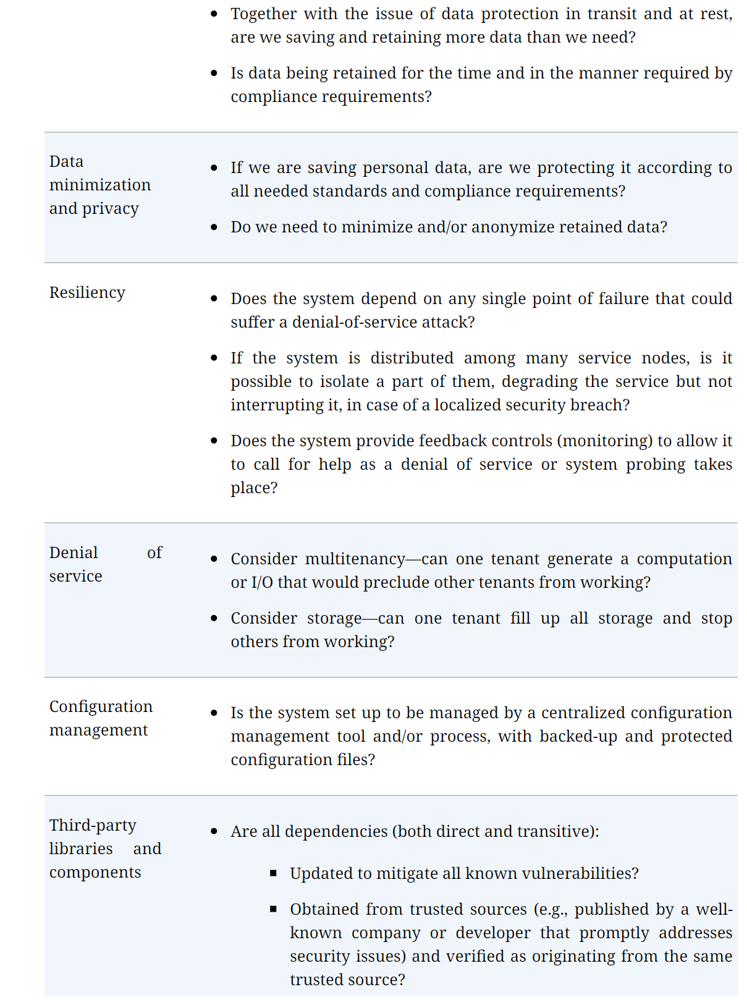
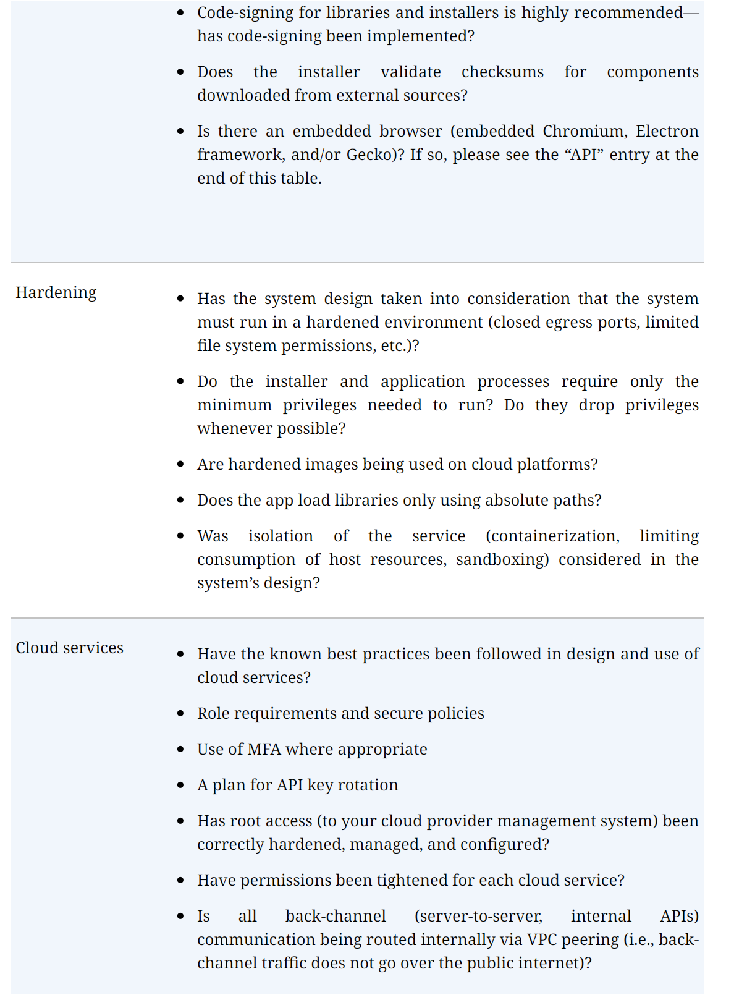

# Threat Modeling: A Practical Guide
Tarandach, Izar; Coles, Matthew
2020

## Introduction
Threat modeling is the process of analyzing a system to look for weaknesses that come from less desirable design choices.

TM is a cyclic activity

Don't shift left, start left

Developing a secure system
1. idea inception
2. design
3. implementation
4. testing
5. deployment
6. repeat

Terminology

- Weakness is an underlying defect that modifies behavior or functionality or allows incorrect access to data
- Exploitability is a measure of how easy an attacher can make use of a weakness to cause harm
- Vulnerability is a when a weakness is exploitable
- Severity is the damage potential from an defect
    - part art, part science
- Impact is measure of loss of functionality or data
- Actor is any individual associated w/ the system
- Threat is the result of an actor taking advantage of a vulnerability
- Threat event is a success exploitation of a vulnerability
- Loss is when 1 or more impacts happen b/c of threat event
- Risk combines the value of the p

Calculating Risk
- CVSS

- DREAD - qualitative risk calculation
    - Damage
    - Reproducibility
    - Exploitability
    - Affected Users
    - Discoverability
FAIR - Factor analysis of Information Risk
    - Quantitative risk

Core Properties
- COnfidentiality
- Integrity
- Availability
- Privacy
- Safety

Fundamental Controls
- Identification
- Authentication
- Authorization
- Logging
- Auditing

Basic Design Patterns
- Zero Trust - Verify trusted every time
- Design by Contract
- Least Privilege
- Defense in Depth
- KISS
- No Secret sauce - do not rely on "security by obscurity"
- Separation of privilege
- COnsider the human factor
- Effective logging
- Fail secure
- Build in, not bolt on

## Chapter 01: Modeling Systems
modeling = create an abstraction

types of models
- Data flow diagrams
    - shows interactions and intercommunications among system components
    - have layers, top is L0
    - AN element represents process or operating unit
        - annotate each object w/ description and metadata
            - i.e. name, owner, privilege level, language, etc.
    - COntainers are a containing element
    - external entity not in scope for the analysis
        - i.e. web browser
    - Actors are human users of the system
    - Data store is where bulk of data is held
        - annotate w/ data classification, sensitivity, protections, replication, backup.
    - Important Metadata
        - Type of communication channel
        - protocols
        - data being communicated
        - order of operations
        - Arrows indicate direction of data flows
            - decide if single line w/ double arrows or 2 line (one for each direction)
        - Initiator mark can be helpful
        - Focus on what is relevant for the analysis
    - Trust Boundaries - Behind the curve is trusted
        - Metadata defines what kind of trust (i.e. HTTPS)
    - Interface elements for connection points, like ports or service endpoints
        - Metadata is port number, communication channel, auth, etc.
    - Blocks represent and architecture element that selectively alters the data flow
        - metadata
            - type of block
            - Behavior

- sequence diagrams
    - shows a time or event based sequence of actions
    - UML
    - helps find logic flaws
    - Components
        - Actors
        - Messages
        - Conditional Logic
        - Time
- Process flow diagrams
    - shows the sequence and directionality of flow of operations through the system
    - higher level than sequence diagrams
    - not common in threat modeling
- Attack Trees
    - useful in understanding how a system is vulnerable by modeling how an attacker may influence a system (attacker centric approach)
    - Each node is labeled with an action to be taken and should include information such as
        - Difficulty in performing the action to accomplish the parent nodes goal
        - cost
        - required special knowledge or conditions
        - other relevant info
    - Valuable for threat analysis
    - To construct an attack tree:
        1. ID a target for an attack
            - "perform RCE"
        2. ID actions to achieve the target
            - modify memory
            - deliver executable payload to {stack,heap}
            - etc.
        3. rinse and repeat
            - don't worry about feasibility; focus on possibility
    
- Fishbone diagrams
    - cause and effect diagrams
    - used for root cause analysis of a problem statement
    - can help find weakness in a system
    - to construct
        - define what you want to model
        - then ID a set of primary causes that lead to the models effect
        - then define causes of the effects
    

How to build System Models
- ID major building blocks of the system
    - APIs or UIs?
    - Listening on ports?
    - Databases and what comms w/ it?
    - Access control?
- Iterated through every entity
- Then choose an entity that has more detail that needs to be uncovered

Notes
- Timing is important; you need something to model
- different stakeholders will see different things
- Loose ends are OK
- Iterative approach
- establish blame free
- No surprises - be up front with goals
- Training and be prepared

What does a good model look like? 
- Accurate
- Meaningful
- Representative
- Living

## Chapter 02: A Generalize Approach to Threat Modeling
Basic Steps
1. ID objects in the system under consideration
2. ID flows between those objects
3. ID assets of interest
4. ID system weaknesses and vulnerabilities
5. ID threats
6. Determine exploitablity

What are you looking for in a system model? 
- Means for an attack vector
- Opportunity for an attacker to exploit
- Motive for an attacker to conduct an attack against you

The usual suspects
- Non-secure protocols (http, ftp, telnet)
- any process or data store w/o authentication
- any process that fails to authz access to assets or functionality
- any process w/o logging
- sensitive assets in plain text
- sensitive assets w/o integrity controls
- incorrect use of cryptography
    - hashing info that needs to be read or used in orginal form
    - encrypting w/ symmetrical algorithm when key is on the same component as the data
    - not using a secure random number generator
    - homegrown crypto algorithm
- Communication paths transiting a trust boundary

**You will not find implementation flaws w/ Threat Modeling**

Threat Intelligence Gathering
- MITRE ATT&CK framework

## Chapter 03: Threat Modeling Methodologies
3 stages
1. No previous security goals and little knowledge
2. a security champion is appointed
3. all individuals own product security equally

Adam Shostacks' 4 question framework
1. What are we working on?
2. What could go wrong?
3. What are we going to do about it?
4. Did we do a good job?

How to translate a system into a model; 3 main approaches
- system-centric approach (most prevalent in threat modeling)
- Attack-centric approach
- asset-centric approach

STRIDE
- Spoofing
- Tampering
- Repudiation
- Information Disclosure
- Denial of Service
- Elevation of Privilege

- You can also do STRIDE per element

PASTA
- Process for Attach Simulation and Threat Analysis
- Risk centric

- 7 stage process to quantify the impact to an app
    1. Define business obj
        - Business requirement
        - security and compliance requirement
        - Perform preliminary business impact assessment
        - define risk profile
    2. Define technical scope
        - software components
        - ID actors and data sources (created, sinks and stored)
        - system level services
        - third party infrastructures
        - assert complexness of secure tech design
    3. Decompose the app
        - enumerate all app use cases
        - construct DFD
        - perform security functional analysis
    4. Perform threat analysis
        - analyze overall threat scenario
        - gather threat intel from internal,external sources
        - update threat libs
        - map threat agents to assets mapping
        - assign probities to id'ed threats
    5. Detect vulnerabilities
        - review and correlate existing vulnerability data
        - ID weak design patterns in architecture
        - map threats to vulnerabilities
        - conduct targeted vulnerability testing
    6. Enumerate Attacks
        - update attack lib and vectors and control framework using the latest threat intel sources (CISA) 
        - ID the attack surface
        - analyze id'ed attack scenarios
        - assess the probability and impact of each scaron
        - derive a set of cases to test existing countermeasures
    7. Perform risk and impact analysis
        - determine risk of each threat
        - ID countermeasures
        - calculate residual risks
        - recommend a strategy to manage residual risk
- RACI is different for every stage

TARA
- Threat Assessment and Remediation Analysis
- Developed by MITRE, use in many military applications
- Cyber threat susceptibility assessment (CTSA) creates a table mapping tactics, techniques and procedures (TTPs)
    - the target TTP name 
    - reference source for the ttp
    - Plausibe? 
    - Rational?
- Features 
    - can perform TARA on deployed or systems still in acquisition
    - use of stored catalogs or TTM and countermeasure (CMs) promote consistency
    - TTP and CM catalog data is derived from opensource and classified sources
    - not a 1 size fits all; level of effort can be adjusted
    - toolset provided default scoring tools 

TRIKE
- stands out by trying to generate threats semiautomatically
- but pretty out of date 
- Phases
    - requirements model
    - Implementation model 
    - threat model 
    - risk model 

Specialized Methodologies
- LINDDUN - focused on data subjects' privacy
    - linkability
    - identifiability
    - non repudiation
    - detectability
    - disclosure of info
    - unawareness
    - noncompliance
- SPARTA
    - Security and Privacy Architecture through Risk driven threat assessment
    - a GUI tool for DFD creation
    - Uses FAIR and adds Monte Carlos simulations for each risk from FAIR
- INCLUDES NO DIRT
    - STRIDE + LINDDUM + C + O
        - Clinical Error
        - Over Use
    - Choose your own adventure style process flow
    - very rigid

## Chapter 04: Automated Threat Modeling
threat modeling the traditional way is hard
- highly specialized talent is required
- there is a lot to know
- too many options
- hard to convince stakeholders
    - every one is buy
- time and effort

2 approaches
- Threat modeling from code - DSL 
    - Threatspec
        - does require code to exist; but does not perform analysis
        - uses code annotations
        - allows org to define common lexicon of threats and other structures
        - facilitates security discussion
        - auto generates details and useful docs
    - ThreatPlaybook
        - DevSecOps framework for threat modeling and app security test automation
        - makes docs easier
        - connects w/ other security tools for orchestration
- Threat modeling with code - program to interpret info
    - Architecture Analysis and Design Language (AADL) (paid)
    - Acme description language (free)
    - Others
        - Common information model (CIM) 
        - Unified modeling language (UML)
        System modeling language (SysML)
    - OWASP pytm
        - Like others, but python
        - can make DFD, sequence anf reports
    - Threagile
        - Tool in Go, define in YAML
        - does lots of reporting
- Others
    - IriusRisk
    - SD Elements
    - ThreatModeler
    - OWASP ThreatDragon
    - Microsoft Threat Modeling Tool
    - CAIRIS
    - Tutamen Threat Model Automator

- Look at AI/ML now

## Chapter 05: Continuous Threat Modeling
guiding principles
- product team will always know its own system better than a security expert
- a team cannot be expected to stop to engage in threat modeling
- and individualized increasing returns learning curve replaces training
    - quality of the model grow with experience
- the state of the threat model myst reflect the stat of the system
- finding must match; be useful

Autodesk Continuous Threat Modeling Methodology
- Handbook - 5years old 

How often do living does need to breathe? 
- change only on security notable events or changes

Build a baseline
- Define the scope
- ID important assets
- draw diagrams
- draw DFDs
- Mark where the important data lives, transits and transforms

start w/ L0 and evolve into more detailed L1 DFD
DFD Checklist
1. complete diagram, including deployment
2. label each component
3. label each direction of each data flow w/ arrows
4. label actions for each arrow
5. label the protocol
6. label the trust boundary
7. label main types of data and how they flow
8. describe personas
9. label auth process
10. label authz process
11. labe order of action numerically
12. labe crown jewls

Leading questions for each subject

encourage exploration of these questions

Threat model every story
Secure Developer Checklist
https://github.com/Autodesk/continuous-threat-modeling/blob/master/Secure_Developer_Checklist.md
https://owasp.org/www-project-secure-coding-practices-quick-reference-guide/stable-en/02-checklist/05-checklist

## Chapter 06: Own Your Role as a Thread Modeling Champion
Simple questions, like "how do I convince leadership"

