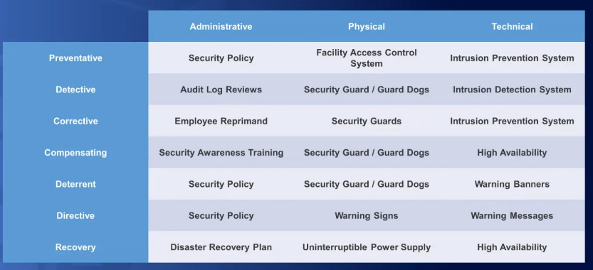

# Risk Management

## Concepts

process to ID assess and determine how to handle known risks

Threat is potential for unwanted harm
Vulnerability is weakness in an org asset that can cause harm

`risk = threats * vulnerabilities`

Components
* Frame: understand how the org reacts to risk
* Assess: research and analyze org assets to discover possible risk
* Respond: determine best course of action to address risk
* Monitor: verify the response is effective and compliant

## Risk Response and Monitoring

Response is org mgmt decision on how to address a specific risk

Response
* Mitigation: reduce risk to acceptable level
* Assign: allocate risk to some one else (transfer)
* Deterrence: implement deterrent controls to reduce risk
* Avoidance: Don't introduce changes to that will increase the risk
* Acceptance: you accept the consequences

Monitoring
* Effectiveness: determine if risk response was effective
* Compliance: ensure response is compliant
* Response Updates: based on effectiveness and overall impact
* Follow on analysis: to maintain

Continuous Improvement
* Adapt risk Mgmt to org and tech change
* Perform Cost/Benefit analysis of security controls that are not performing
* Update the risk responses based on new information and monitor risk over time

Circular lifecycle

Risk Maturity Model
* heat map

## Controls and Countermeasures

Controls are admin, physical, and or technical safeguards or countermeasures

Control Selection
* Cost: Control should cost less than the benefit and asset value
* Benefit must solve org problem
* Security: The controls should provide consistent protection, reduce risk and be compliant with governance

Defense in Depth
Asset -> Admin Controls -> Tech logical controls -> Physical controls

Types of controls
* Deterrent: Discourage unauthorized actions
* Preventative: Stop unauthz actions
* detective: Discover unauthz actions
* Corrective: correct or modify unauthz actions
* Compensating: support other controls
* Directive: direct compliance w/ sec policy
* recovery: recovery from an event

Matrix 

## Continuous Monitoring

Maintain ongoing awareness of org risk and security posture

Regularly evaluate security controls effective against current threats and vulnerabilities

Maintaining full situational awareness by assessing all sec controls

References
NIST SP 800-137: Info Sec Continuous Monitoring (ISCM)
ISO 27004: Monitoring, Measurement, analysis and evaluations

Monitoring Strategy
* Scope: what will be evaluated
* Method: How will be evaluated
* Frequency: How often are they evaluated
* Metric: how are result measure and tracked

NIST Process
* Define Strategy
* Establish metrics methods frequencies and scope
* Implement methods to collect monitoring data
* Analyze data and report findings
* Respond to known risks using controls
* Review/Update the monitoring program by adjusting strategies

## Supply Chain Risk Mgmt (SCRM)

SUpply chain is network between org an supplies to provide 

Frameworks
* NIST IR 7622: nation Supply Chain Risk Mgmt Practices for Federal Info Systems
* CNSSD 505: SUpply Chain Risk Mgmt
* ISO 28000 Spec for sec mgmt systems for the supply chains

SCRM
* Purpose: evaluate risk in supply chain
* Risk Analysis of each supplier , vendor or provider to ID obvious risks
* Compliance: many laws that require some level of supply chain risk Mgmt

Risks
* Unintentional risk: personnel screening, poor security, unreliable
* Risk with Services: exposing sensitve data, IP exposure
* Hardware: counterfeit, builtin sec features
* software: vulns, malicous code, patching, licenses

Security Requirements
* Define min set of sec requirements
* Acquisition strategy to reduce risk
* Create SLA to define requirements

Assessments
* On-site visit to observe
* Doc Review
* 3rd party audit

Consider every link in chain
Raw material to Customer