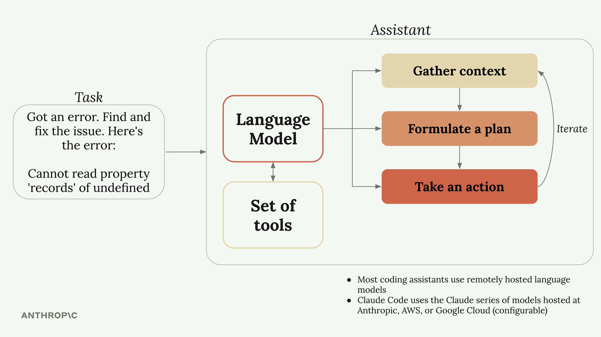

# Claude Code In Action
Skilljar

## What is a Coding Assistant

LLMs do not have direct access to files by default
Coding Assistant is the middleware 
* Appends system messages to LLM
* LLM needs to use tools to do vast majority of tasks

Tool use enables LLMs to get do things

Claude's strong tool use is root to success

## Claude Code Tools
* Bash
* Glob
* ls
* ReadFile
* WebSearch
and so much more

Claude can write code in Jupyter notebook, execute them and review results and iterate

Planning better used for breadth of changes
Thinking is better for depth

