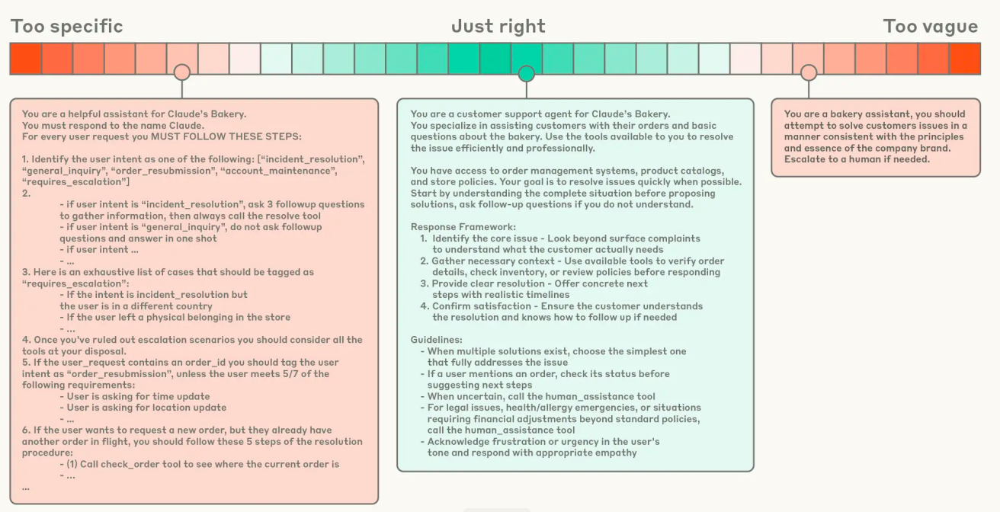

# Anthropic: Context Engineering for AI Agents
https://anthropic.com/engineering/effective-context-engineering-for-ai-agents

2025-09-25

## Context Eng vs Prompt Eng
* context is natural progression of prompt
* Context is set of strategies to for curating and maintaining the optimal set of tokens (information) during LLM inference

As we move toward engineering more capable agents that operatie over multiple turns of inference and longer time, we need tools to manage the entire context state(system instructions, tools, MCP, external data, message history, etc.)

Context engineering is the science of curating what will go in the limited context window 

## Why context eng is important to build capable agenst
LLMs lose focus or experience confusion at a certain point
As number of tokens in context increases, the models ability to recall info from that context decreases

## Anatomy of effective context
Good context engineering means finding the smallest possible set of high signal tokens that maximize the likelihood of your desired output.

**System prompts** should be extremely clear and use simple direct language that presents ideas that the right altitude of the agent

* Organize into distinct sections
    * Background
    * instructions
    * tool guidance
    * output guidance

**Tools** allow agents to operate w/ their env and pull in new additional context as they work
* Do not bloat toolset

## Context Retrieval and agentic search

Using a combo of embeddings and Just in time context

Metadata is important
Folder hierarchies, naming conventions and timestamps provide more signals

Trade-off: Letting the agent perform runtime exploration is slower than retrieving precomputed data

A hybrid may be better suited for contexts with less dynamic content

## Long Horizon
<read, but not relevant to my use case today>